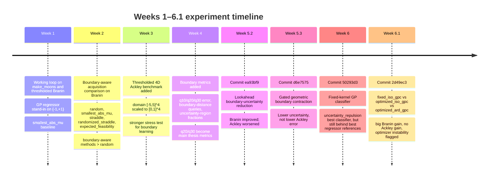

# Analytical Report on Weeks 1–6.1 of the Active Level-Set Thesis Project

## Executive summary

Across Weeks 1–6.1, the project moved from a warm-up Gaussian-process regression surrogate on \(\{-1,+1\}\) labels to classifier-native probability-based active learning, and then to optimized GP-classifier variants. The central empirical result is now very clear: **simple boundary-aware heuristics were surprisingly robust on the harder 4D Ackley benchmark, while more principled or more complex ideas often improved diagnostics without improving true boundary error**. In particular, on 4D Ackley, the strongest GP-regression baselines remained `straddle` for global error and `randomized_straddle` for q20/q30 near-boundary error; neither the lookahead rule (Week 5.2), nor curvature-aware GBC (Week 5.3), nor the fixed-kernel GP classifier (Week 6), nor the optimized GP classifier (Week 6.1) clearly beat those references on the main boundary metrics. fileciteturn0file8 fileciteturn0file4 fileciteturn0file1

The negative results are not failures in the thesis sense; they are informative diagnostics. Week 5.2 showed that **closer-to-boundary querying is not enough**: lookahead selected points with smaller true boundary distance on Ackley, but ended with worse q20/q30 error than `straddle` and `randomized_straddle`. Week 5.3 showed that **shrinking the model’s latent uncertainty region is not enough**: GBC reduced q20/q30 latent uncertainty fractions on Ackley but still had worse q20/q30 boundary error than the simpler baselines. Week 6 showed the exact same pattern on the classifier side: **lower classifier uncertainty-region fraction did not imply better boundary accuracy**, since `random` often produced the smallest uncertainty-region fractions while remaining the worst method in boundary error. fileciteturn0file9 fileciteturn0file5 fileciteturn0file1

Week 6.1 is the most important transition point. The fixed-kernel classifier result from Week 6 was not the final word: when GP-classifier hyperparameters were optimized, **Branin improved dramatically**. According to the Codex run for commit `2d49ec3`, the best Week 6.1 Branin result was `optimized_ard_gpc / classifier_gated_diversity` with global/q20/q30 \(= 0.03515 / 0.16375 / 0.114333\), beating the available GP-regressor references. On **Ackley**, however, the best result still came from the **fixed** classifier (`fixed_iso_gpc / classifier_uncertainty_repulsion`, \(0.1759 / 0.4175 / 0.379667\)), and optimized hyperparameters did not improve the main boundary metrics. Codex also reported frequent hyperparameter bound hits, especially on Ackley, so Week 6.1 should be read as **diagnostic evidence of optimizer instability in the harder 4D setting**, not as a blanket success or failure of GP classification.

The thesis-level lesson is now strong and defensible. **GP classification is promising when the geometry is simpler and smoother**, as Branin shows after optimization. But **the GP-regression stand-in remains more robust on the hard 4D benchmark under the current acquisition and kernel setup**, and more complex acquisitions can become confidently wrong if the surrogate is miscalibrated or unstable. The next best experiments are therefore not more acquisition inventions by default, but a focused sequence: **kernel-sensitivity and constrained optimization on the classifier**, **probability calibration**, **controlled 2D diagnostics**, and one carefully-scoped **ESMR-lite / boundary-integrated variance-reduction test** on the GP-regression surrogate before moving to the real laser dataset. fileciteturn0file2 fileciteturn0file5 fileciteturn0file9

## Experimental trajectory

The weekly progression is coherent and thesis-aligned: Week 1 established a functioning pool-based active-learning loop; Week 2 compared standard boundary-aware heuristics on thresholded Branin; Week 3 introduced thresholded 4D Ackley as a named benchmark closer to the laser application; Week 4 added the genuinely important evaluation diagnostics—q10/q20/q30 near-boundary error, query distance to the true threshold boundary, and uncertainty-region fractions; Week 5 tested richer acquisition ideas under the GP-regression stand-in; Week 6 replaced the stand-in with a fixed-kernel GP classifier; Week 6.1 then asked the real surrogate question: whether learning classifier hyperparameters changes the conclusion. The Week 5.2, 5.3, and 6 notes explicitly frame these experiments as fair, benchmark-controlled comparisons with preserved prior outputs rather than ad hoc one-off runs. fileciteturn0file9 fileciteturn0file5 fileciteturn0file2



A concise headline table is useful for thesis slides.

| Stage | New element | Best Branin headline | Best Ackley headline | Main lesson |
|---|---|---:|---:|---|
| Weeks 2–4 | GP-regressor baselines + boundary metrics | strongest original Branin references around 0.0602 global, 0.24675 q20, 0.1865 q30 | `straddle` best global 0.1684; `randomized_straddle` best q20/q30 0.4084/0.3682 | Simple boundary heuristics are hard to beat |
| Week 5.2 `ea93bf9` | Lookahead uncertainty reduction | 0.0559 / 0.2355 / 0.1753 | 0.2290 / 0.4442 / 0.4080 | Helped 2D, failed 4D |
| Week 5.3 `d6e7575` | Curvature-aware GBC | 0.0717 / 0.2718 / 0.2100 | 0.2004 / 0.4220 / 0.3847 | Lower uncertainty did not mean lower error |
| Week 6 `50293d3` | Fixed-kernel GPC | 0.0804 / 0.2610 / 0.1978 | 0.1759 / 0.4175 / 0.3797 | Classifier not automatically better |
| Week 6.1 `2d49ec3` | Optimized GPC | 0.03515 / 0.16375 / 0.11433 | 0.1759 / 0.4175 / 0.3797 | Optimization helped Branin, not Ackley |

The Week 5.2/5.3/6 entries above come from the project output summaries; the Week 6.1 entry comes from the Codex terminal report for commit `2d49ec3` supplied in chat, because the full branch artifact set was not directly retrievable in this session. fileciteturn0file10 fileciteturn0file5 fileciteturn0file3

## Benchmarks, data protocol, and metrics

The benchmark protocol stabilized by Weeks 5–6 and remained conceptually consistent across the later experiments. The project used two synthetic deterministic thresholded functions. The first is **thresholded Branin** on \(x_1 \in [-5,10]\), \(x_2 \in [0,15]\), with a threshold taken at the 45th percentile, estimated from 20,000 threshold-sampling evaluations using seed 2026. In the full runs, the Branin pool size is 1,500, the test size is 4,000, the initial labelled set is 6, and the final budget is 50; original coordinates are linearly scaled to \([0,1]^2\) before fitting the surrogate. The second is **thresholded 4D Ackley** on \([-5,5]^4\), with threshold at the 50th percentile; the pool size is 4,000, the test size is 10,000, the initial labelled set is 12, and the final budget is 80; original coordinates are linearly scaled to \([0,1]^4\). In all later comparisons, seeds were \(0,1,2,3,4\), and fairness checks required the same threshold, pool, test set, initial labelled indices, and budget grid across methods. fileciteturn0file11 fileciteturn0file6 fileciteturn0file0 fileciteturn0file1

The later evaluation protocol is also now clear and thesis-appropriate. Each benchmark records **global test-label error** and **near-boundary error on q10/q20/q30 subsets**, where these subsets are defined by the closest 10%, 20%, and 30% of test points under the true function-value threshold distance \(|f(x)-\tau|\). Query behavior is measured via **query distance to the true threshold boundary**, again using \(|f(x_{query})-\tau|\), which is explicitly evaluation-only and never used inside acquisition. Weeks 5 regressor experiments use a **latent uncertainty-region fraction** defined by \(|\mu(x)| \le 1.96 \sigma(x)\). Week 6 classifier experiments use a **classifier uncertainty-region fraction** defined by \(|p_+(x)-0.5|\le \varepsilon\), with \(\varepsilon=0.10\) as the primary value and \(\varepsilon=0.05\) as optional detail. The methodological point of Week 4 onward is that global error alone is not enough; q20 and q30 are the main near-boundary metrics, while q10 is informative but noisier. fileciteturn0file9 fileciteturn0file5 fileciteturn0file2

A compact benchmark table for the thesis is below.

| Benchmark | Domain | Threshold rule | Pool | Test | Initial labels | Final budget | Scaling |
|---|---|---|---:|---:|---:|---:|---|
| Thresholded Branin | \(x_1\in[-5,10], x_2\in[0,15]\) | 45th percentile, seed 2026, 20k threshold samples | 1,500 | 4,000 | 6 | 50 | linear to \([0,1]^2\) |
| Thresholded 4D Ackley | \([-5,5]^4\) | 50th percentile | 4,000 | 10,000 | 12 | 80 | linear to \([0,1]^4\) |

These settings were reused across the Week 5.2, Week 5.3, and Week 6 scripts and benchmark summaries. fileciteturn0file11 fileciteturn0file6 fileciteturn0file0

## Surrogates and acquisition rules

The project used two surrogate families. Weeks 1–5 relied on a **GaussianProcessRegressor stand-in** trained on numerical labels \(\{-1,+1\}\), with boundary prediction defined by the sign of the latent mean and active learning driven by latent mean/standard deviation heuristics. This choice is easy to work with because scikit-learn’s `GaussianProcessRegressor.predict` can directly return the predictive mean and standard deviation—or covariance—at query points. In contrast, Week 6 switched to a **GaussianProcessClassifier**, which in scikit-learn is based on a Laplace approximation with a logistic link and exposes `predict_proba`; kernel parameters are optimized by default with L-BFGS-B unless bounds are fixed or `optimizer=None` is used. That difference is exactly why Week 6 stopped reusing \((\mu,\sigma)\)-based regressor acquisitions verbatim and introduced probability-native acquisitions instead. citeturn6view1turn6view3turn6view4 fileciteturn0file2

The accessible late-stage surrogate specifications are:

| Stage | Surrogate | Exact setting |
|---|---|---|
| Weeks 1–5 | GP regressor stand-in | scikit-learn `GaussianProcessRegressor` on \(\{-1,+1\}\); later Weeks 5.2/5.3 keep using the inherited `fit_gp` helper |
| Week 6 | `fixed_iso_gpc` | `ConstantKernel(1.0 fixed) * RBF(length_scale=0.25 fixed)`, `optimizer=None`, `n_restarts_optimizer=0`, `max_iter_predict=100` |
| Week 6.1 | `fixed_iso_gpc` | same as Week 6 |
| Week 6.1 | `optimized_iso_gpc` | `ConstantKernel(1.0, bounds=(0.1,10.0)) * RBF(length_scale=0.25, bounds=(0.03,3.0))`, `optimizer='fmin_l_bfgs_b'`, `n_restarts_optimizer=2`, `optimize_every=1` in the reported full run |
| Week 6.1 | `optimized_ard_gpc` | same constant kernel, but RBF length-scale initialized as a vector \([0.25,\dots,0.25]\) with the same bounds, optimized with L-BFGS-B and 2 restarts in the reported full run |

The Week 6 fixed-kernel specification is directly documented in the script and benchmark summary; the Week 6.1 optimized settings come from the explicit Codex experiment specification and run report for commit `2d49ec3`, which also recorded that no runtime reduction was applied (`n_restarts_optimizer=2`, `optimize_every=1`). fileciteturn0file0 fileciteturn0file1 citeturn6view1

The acquisition trajectory is the real intellectual story of the project. The inherited and later-added rules are:

| Week | Methods | Formula or analogue |
|---|---|---|
| Week 1 | `smallest_abs_mu` | choose smallest \(|\mu(x)|\) under GP-regression stand-in |
| Week 2–4 | `random` | uniform random pool point |
| Week 2–4 | `straddle` | \(1.96\,\sigma(x)-|\mu(x)|\) |
| Week 2–4 | `randomized_straddle` | inherited Week 2 baseline; exact helper implementation retained in `src/acquisition_rules.py`, not re-opened locally in this session |
| Week 2–4 | `expected_feasibility` | inherited Week 2 baseline; exact helper implementation retained in `src/acquisition_rules.py`, not re-opened locally in this session |
| Week 5.1 | `diversified_straddle` | normalize straddle and nearest-labelled-point distance; choose \((1-\alpha)\,\widetilde{\text{straddle}} + \alpha\,\widetilde{\text{diversity}}\), \(\alpha=0.25\) |
| Week 5.1 | `boundary_gated_diversified_straddle` | keep top 10% by straddle, min shortlist 25; then choose \((1-\beta)\,\widetilde{\text{straddle}} + \beta\,\widetilde{\text{diversity}}\), \(\beta=0.5\) |
| Week 5.2 | `lookahead_boundary_uncertainty_reduction` | shortlist top 30 by straddle, fantasy-label \(+1/-1\), fixed-kernel fantasy posterior refits; choose largest expected reduction in mean positive straddle over current unlabelled pool |
| Week 5.3 | `gated_geometric_boundary_contraction` | shortlist top 200 by straddle; score \(=\widetilde{\kappa}\cdot\widetilde{\sigma}\cdot w_{boundary}\cdot \text{repulsion}\) |
| Week 6 | `classifier_margin` | \(1-2|p_+(x)-0.5|\) |
| Week 6 | `classifier_entropy` | \(-p\log p -(1-p)\log(1-p)\) |
| Week 6 | `classifier_gated_diversity` | gate top 10% by classifier margin, min shortlist 25; score \((1-\beta)\widetilde{u} + \beta\widetilde{d}\), \(\beta=0.5\) |
| Week 6 | `classifier_uncertainty_repulsion` | gate top 10% by classifier margin, min shortlist 25; score \(\widetilde{u}\cdot \left(1-\exp(-d_{\min}^2/(2b^2))\right)\), \(b=0.15\) |

The exact Week 5.2, 5.3, and 6 formulas are documented directly in the scripts and notes. The more general classifier-side rationale also matches scikit-learn’s interface separation: `GaussianProcessClassifier` is probability-native through `predict_proba`, whereas `GaussianProcessRegressor` natively returns mean/std and covariance. For binary GPC in newer scikit-learn versions, `latent_mean_and_variance` is also available, which opens a plausible future route to a more classifier-native “straddle-like” acquisition without regressing on labels. fileciteturn0file11 fileciteturn0file9 fileciteturn0file6 fileciteturn0file5 fileciteturn0file0 fileciteturn0file2 citeturn6view0turn6view2

## Results and interpretations

### Branin

Branin is where the optimistic story for classifier-side modeling lives. The strongest available pre-Week 6.1 GP-regression headline on Branin came from Week 5.2 lookahead: global/q20/q30 \(= 0.0559 / 0.2355 / 0.175333\). Week 5.3 GBC was strictly worse on Branin at \(0.0717 / 0.27175 / 0.2100\). Week 6 fixed-kernel GP classification also remained worse than the best regressor references, with the best classifier method (`classifier_uncertainty_repulsion`) reaching \(0.0804 / 0.2610 / 0.197833\). But Week 6.1 changed the conclusion on this benchmark: the Codex run report for commit `2d49ec3` states that `optimized_ard_gpc / classifier_gated_diversity` reached \(0.035150 / 0.163750 / 0.114333\), beating both the fixed classifier and the available GP-regressor references. The Week 6 combined classifier summary already showed that the fixed classifier did **not** beat the best GP-regressor Branin references, which makes the Week 6.1 improvement especially meaningful. fileciteturn0file10 fileciteturn0file3

A concise Branin table for thesis writing is:

| Branin result | Global | q20 | q30 | Interpretation |
|---|---:|---:|---:|---|
| Best pre-Week 6.1 regressor reference (`lookahead`, Week 5.2) | 0.0559 | 0.2355 | 0.1753 | Best accessible GP-regressor headline before optimized GPC |
| GBC (Week 5.3) | 0.0717 | 0.2718 | 0.2100 | Curvature heuristic hurt relative to best references |
| Best fixed classifier (Week 6) | 0.0804 | 0.2610 | 0.1978 | Classifier family alone was not enough |
| Best optimized classifier (Week 6.1) | 0.0352 | 0.1638 | 0.1143 | Strong evidence that kernel learning can matter |

The Branin diagnosis is therefore positive but specific. In a lower-dimensional smoother problem, **classifier hyperparameter learning appears genuinely useful**, and ARD did not destabilize the loop in the way it later did on Ackley. The natural inference is not “GP classification is always better,” but rather: **once the geometry is simple enough for the classifier optimization problem to remain well-conditioned, a classifier-native surrogate can substantially improve boundary-focused learning**. That is exactly the kind of nuance a thesis examiner will appreciate.

### Ackley

Ackley is the benchmark that prevents overclaiming. The full Week 5.2 Ackley table, compiled from the benchmark summary JSON, is below. It shows that the strongest simple rules were still `straddle` globally and `randomized_straddle` near the boundary, while lookahead—despite querying closer to the true boundary than several baselines—performed much worse in q20 and q30. fileciteturn0file8 fileciteturn0file9

| Method | Global | q20 | q30 | Median query distance |
|---|---:|---:|---:|---:|
| `straddle` | 0.1684 | 0.4154 | 0.3697 | 1.2822 |
| `randomized_straddle` | 0.1754 | 0.4084 | 0.3682 | 1.2508 |
| `diversified_straddle` | 0.1824 | 0.4185 | 0.3776 | 1.4158 |
| `boundary_gated_diversified_straddle` | 0.1844 | 0.4126 | 0.3757 | 1.2745 |
| `expected_feasibility` | 0.1898 | 0.4293 | 0.3899 | 1.5190 |
| `lookahead_boundary_uncertainty_reduction` | 0.2290 | 0.4442 | 0.4080 | 0.8887 |
| `smallest_abs_mu` | 0.2362 | 0.4396 | 0.4126 | 0.8398 |
| `random` | 0.2827 | 0.4593 | 0.4342 | 1.1303 |

The Week 5.2 interpretation written in the project notes is exactly right: the fantasy-label lookahead objective used heuristic GP-regression probabilities \(p_+=\Phi(\mu/\sigma)\), not calibrated classifier probabilities, and it optimized expected latent uncertainty reduction, not true boundary correctness. That likely explains why it could query near the true boundary and still lose badly on q20/q30. fileciteturn0file9 fileciteturn0file11

Week 5.3 tells a related but distinct story. The full Ackley GBC comparison shows that GBC did reduce latent uncertainty fractions q20/q30 relative to several baselines, but its q20/q30 errors still trailed `straddle`, `randomized_straddle`, and the boundary-gated diversity baseline. fileciteturn0file4 fileciteturn0file5

| Method | Global | q20 | q30 | Median query distance | q20 uncertainty frac | q30 uncertainty frac |
|---|---:|---:|---:|---:|---:|---:|
| `straddle` | 0.1684 | 0.4154 | 0.3697 | 1.2822 | 0.8787 | 0.8685 |
| `randomized_straddle` | 0.1754 | 0.4084 | 0.3682 | 1.2508 | 0.8765 | 0.8656 |
| `diversified_straddle` | 0.1824 | 0.4185 | 0.3776 | 1.4158 | 0.8958 | 0.8863 |
| `boundary_gated_diversified_straddle` | 0.1844 | 0.4126 | 0.3757 | 1.2745 | 0.8716 | 0.8653 |
| `expected_feasibility` | 0.1898 | 0.4293 | 0.3899 | 1.5190 | 0.8565 | 0.8418 |
| `gated_geometric_boundary_contraction` | 0.2004 | 0.4220 | 0.3847 | 1.2927 | 0.8380 | 0.8337 |
| `smallest_abs_mu` | 0.2362 | 0.4396 | 0.4126 | 0.8398 | 0.9638 | 0.9609 |
| `random` | 0.2827 | 0.4593 | 0.4342 | 1.1303 | 0.9493 | 0.9470 |

This is one of the cleanest negative-but-informative results in the project. GBC’s q20 latent uncertainty fraction of \(0.8380\) is lower than `straddle`’s \(0.8787\) and `randomized_straddle`’s \(0.8765\), yet GBC’s q20 error \(0.4220\) is worse than both. That is almost a textbook illustration of **becoming confidently wrong**. The Week 5.3 notes also offer the right technical reasons: finite-difference curvature is noisy, the diagonal Hessian proxy is crude, and curvature of the posterior mean can be badly misaligned with actual useful boundary information under a GP-regression stand-in. fileciteturn0file5 fileciteturn0file6

Week 6 then moved to the classifier family. On Ackley, the full fixed-kernel classifier summary shows that `classifier_uncertainty_repulsion` was the best classifier method, reaching global/q20/q30 \(= 0.1759 / 0.4175 / 0.379667\), followed closely by `classifier_gated_diversity`. However, the best GP-regressor references remained ahead: `straddle` still had the best global error at \(0.1684\), while `randomized_straddle` still had the best q20/q30 at \(0.4084 / 0.3682\). fileciteturn0file1 fileciteturn0file2 fileciteturn0file3

| Week 6 Ackley classifier method | Global | q20 | q30 |
|---|---:|---:|---:|
| `random` | 0.2847 | 0.4604 | 0.4409 |
| `classifier_margin` | 0.2085 | 0.4271 | 0.3899 |
| `classifier_entropy` | 0.2085 | 0.4271 | 0.3899 |
| `classifier_gated_diversity` | 0.1803 | 0.4275 | 0.3857 |
| `classifier_uncertainty_repulsion` | 0.1759 | 0.4175 | 0.3797 |

The single most important diagnostic inside Week 6 is that the classifier uncertainty-region fraction does **not** align with correctness. In fact, `random` achieved the *smallest* final \(\varepsilon=0.10\) uncertainty-region fractions globally and on q20/q30, while being the worst method in full error terms. That repeats the Week 5 lesson in an even clearer form under a probability surrogate: **confidence contraction is not correctness unless the confidence is centered on the right boundary geometry**. fileciteturn0file1

Week 6.1 sharpens the interpretation. According to the Codex run report for commit `2d49ec3`, the optimized classifier **did not** improve Ackley: the best Ackley result still came from `fixed_iso_gpc / classifier_uncertainty_repulsion`, exactly matching the Week 6 fixed-classifier headline. The report also states that optimized hyperparameters beat fixed only on Branin, not Ackley; ARD helped Branin, not Ackley; and bound hits were common, especially on Ackley. The strongest reading is therefore: **on the hard 4D benchmark, the classifier optimization problem itself became unstable enough that it did not improve the active-learning loop**, and may have degraded the acquisition signal.

## Methodological lessons for the thesis

The first major lesson is that **the surrogate family matters, but not in a simplistic direction**. A GP classifier is more appropriate in principle for binary labels because it models class probabilities directly, whereas the GP-regression stand-in regresses on artificial \(\pm 1\) targets. That theoretical motivation is reflected both in scikit-learn’s API design and in the project’s Week 6 move to probability-native acquisition functions. But the experiments show that “more appropriate” does not mean “automatically better.” On Branin, optimization made the classifier convincingly stronger; on Ackley, the simpler GP-regression stand-in still looked more robust. citeturn6view1turn6view3 fileciteturn0file3

The second lesson is that **uncertainty-region fraction is a model-belief diagnostic, not a correctness metric**. Week 5.2 already hinted at this when `expected_feasibility` achieved the lowest Ackley latent uncertainty fractions but did not win on q20/q30 error. Week 5.3 reinforced it when GBC reduced q20/q30 uncertainty fractions but still worsened q20/q30 classification. Week 6 made it unavoidable: `random` often *minimized classifier uncertainty-region fraction while maximizing error*. The right thesis posture is therefore cautious: uncertainty contraction can be useful, but only if it is empirically tied to boundary correctness, which must still be evaluated on q20/q30. fileciteturn0file8 fileciteturn0file4 fileciteturn0file1

The third lesson is that **querying near the true boundary is not enough**. The most direct counterexample is Week 5.2 Ackley: lookahead had median query distance \(0.8887\), closer than `straddle` and `randomized_straddle`, but much worse q20/q30 error. `smallest_abs_mu` produces an even more extreme version: it queries closest to the boundary among several regressor methods, yet its acquired information does not translate into the best near-boundary predictions. The active level-set problem is not merely “sample near the boundary”; it is “sample where the surrogate can turn those samples into a better estimate of the boundary geometry.” fileciteturn0file8

The fourth lesson is that **high-dimensional optimization can be more dangerous than theoretically sophisticated acquisition design**. In Week 6.1, ARD helped on 2D Branin but not on 4D Ackley. This is not paradoxical once the active loop is viewed as a feedback system: early surrogate misspecification produces slightly worse queries, which in turn produce a worse posterior surface for subsequent optimization, which then makes the acquisition score less reliable. Frequent hyperparameter bound hits on Ackley fit that story. This is why the next steps should not be sold as “the optimized classifier will solve it,” but as a careful model-calibration and optimizer-stability study.

The fifth lesson is rhetorical but important: **the thesis should avoid overclaiming geometry-aware or information-theoretic acquisitions unless the benchmark evidence is stable across dimensionality**. Both lookahead and GBC are thesis-relevant ideas. Both produced sound negative results on Ackley. That is scientifically useful. The right claim is not “these methods failed,” but rather “their success depended strongly on surrogate quality, probability calibration, and dimensionality.” That is a stronger thesis position than claiming winners too early.

## Recommended next experiments and concrete run plan

The next experiments should prioritize **disentangling surrogate quality from acquisition quality**, not adding complexity for its own sake.

The highest-priority experiment is a **kernel-sensitivity sweep for the GP classifier**. The Week 6 vs 6.1 story already implies that fixed length-scale \(0.25\) was too restrictive on Branin, while unconstrained optimization was unstable on Ackley. A controlled sweep over a small set of fixed isotropic length-scales—ideally for only `classifier_margin` and `classifier_uncertainty_repulsion`—would tell you whether Ackley’s problem is mostly **mis-specified smoothness** or deeper classifier instability. This is cheaper and cleaner than another acquisition invention, and it directly resolves whether the fixed Week 6 result was unfair to GPC.

The second-priority experiment is **constrained or periodic GP-classifier optimization**. The Week 6.1 result strongly suggests that full per-step optimization with two restarts is too aggressive for Ackley. A very sensible follow-up is to narrow the length-scale bounds, possibly fix the amplitude or narrow its bounds, and optimize only every \(k\) steps—e.g. every 5 queries—reusing the last learned kernel in between. This would test whether the Week 6.1 problem was “optimization itself” or “optimization unconstrained and too early/too often.”

The third-priority experiment is **classifier calibration**. Week 6 used `predict_proba`, but calibrated probabilities were not separately checked. Scikit-learn now offers `CalibratedClassifierCV` with sigmoid, isotonic, and temperature options; importantly, isotonic is explicitly not recommended when calibration-set size is very small, which matters here, while sigmoid calibration is often preferable for very uncalibrated binary models. A small calibration study on top of the best classifier baseline could directly test whether acquisition scores built from \(p_+\) are being distorted by poor probability calibration. citeturn8view0turn8view1turn8view2

The fourth-priority experiment is the **ESMR-lite test on the GP-regression surrogate**. That idea is conceptually stronger than GBC because it is not purely pointwise: it asks whether a candidate query reduces uncertainty *integrated along the believed boundary*. The safest version would not switch to GPyTorch or a full classifier first; instead, it should use the GP-regression posterior covariance and a discrete believed-boundary support set, with aggressive numerical clipping and a straddle gate. If it fails on Ackley, the conclusion will again be useful: integrated geometry-aware acquisition still depends on the reliability of the believed boundary.

The fifth-priority experiment is **controlled 2D slice diagnostics**. This is relatively cheap and very thesis-friendly. On Branin and on 2D slices of Ackley, you can visualize the surrogate mean, uncertainty, believed boundary, and selected points. That will let you directly inspect whether GBC or ESMR-lite is chasing numerical artifacts, whether the classifier uncertainty mass sits on the actual boundary, and whether ARD is behaving sensibly.

The sixth priority is the **real laser-data transition plan**. The methodological backlog is now rich enough that the project can switch to real data once the relabelling is ready without being methodologically empty. The right plan is to bring only the most robust methods into that phase: one GP-regression baseline, one fixed-kernel classifier baseline, one constrained-optimization classifier, and perhaps one geometry-aware diagnostic method if it survives the synthetic benchmarks.

A practical priority table is:

| Priority | Experiment | What it resolves | Expected cost |
|---|---|---|---|
| High | GPC kernel-sensitivity sweep | Was Week 6 mostly a bad fixed length-scale? | 30–90 min |
| High | Constrained/periodic GPC optimization | Was Week 6.1 mostly optimizer instability? | 45–120 min |
| High | Classifier calibration | Are acquisition scores built on miscalibrated \(p_+\)? | 30–90 min |
| Medium | ESMR-lite on GP regressor | Does an integrated boundary-variance criterion help at all? | 45–120 min |
| Medium | 2D slice diagnostics | Are the surrogate and acquisition failures visibly geometric? | 15–45 min |
| Medium | Real laser-data prep pipeline | What minimal robust method set should transfer first? | ongoing |

Recommended next branch names and top three Codex commands are:

```bash
git checkout -b codex/week6-2-gpc-kernel-sensitivity
python -m src.week6_2_gpc_kernel_sensitivity --full --methods classifier_margin classifier_uncertainty_repulsion --length-scales 0.10 0.15 0.25 0.40 0.60
```

```bash
git checkout -b codex/week6-3-constrained-gpc-optimization
python -m src.week6_3_constrained_gpc_optimization --full --methods classifier_margin classifier_uncertainty_repulsion --n-restarts 1 --optimize-every 5 --length-scale-bounds 0.08 1.50 --constant-bounds 0.30 3.00
```

```bash
git checkout -b codex/week6-4-esmr-lite-regressor
python -m src.week6_4_esmr_lite_regressor --full --shortlist-size 200 --boundary-support top_straddle_200 --gradient-eps 1e-6 --covariance-mode posterior
```

## Thesis-ready materials and reproducibility

The thesis should include a small, focused set of figures and tables rather than every generated plot. The highest-value items are:

- **Table: benchmark protocol and budgets.**  
  *Caption:* “Synthetic thresholded benchmark setup used throughout Weeks 2–6.1. q20/q30 errors are the primary near-boundary metrics.”

- **Table: Ackley final metrics under GP-regression methods.**  
  *Caption:* “Final 4D Ackley results for the GP-regression surrogate. `straddle` is best globally; `randomized_straddle` is best on q20/q30.”

- **Table: Branin headline progression from Week 5.2 to Week 6.1.**  
  *Caption:* “Branin transitioned from strong regressor lookahead performance to a decisive win for optimized ARD GP classification.”

- **Figure: global/q20/q30 Ackley error curves for Week 5.2.**  
  *Caption:* “Lookahead did not improve boundary error on 4D Ackley despite selecting closer-to-boundary queries.”

- **Figure: Ackley uncertainty-region curves for Week 5.3.**  
  *Caption:* “GBC lowered latent uncertainty fractions without lowering near-boundary error, illustrating that uncertainty contraction can be confidently wrong.”

- **Figure: Week 6 classifier global/q20/q30 curves on Ackley.**  
  *Caption:* “Within the GP-classifier setting, uncertainty plus repulsion was the strongest acquisition, but it did not beat the best GP-regressor references.”

- **Figure: Week 6.1 learned length-scales over budget.**  
  *Caption:* “Optimized classifier hyperparameters remained stable on Branin but were unstable on Ackley, with frequent bound hits reported in the 4D case.”

- **Figure: query-distance boxplots across Weeks 5–6 methods.**  
  *Caption:* “Selecting points closer to the true threshold boundary does not necessarily yield lower q20/q30 error.”

The shortest thesis-log paragraph to paste into `docs/thesis_progress_log.md` is:

> Weeks 1–6.1 established a complete active-learning benchmark suite for synthetic level-set estimation before the real laser data arrives. The GP-regression stand-in remained surprisingly robust on the harder 4D Ackley benchmark, where `straddle` and `randomized_straddle` consistently outperformed more complex ideas such as lookahead and curvature-aware GBC on q20/q30 boundary error. A fixed-kernel GP classifier did not beat those references, but optimized GP classification substantially improved the 2D Branin benchmark and even beat the available regressor references there. The current interpretation is that classifier modeling is promising, but in the harder 4D setting kernel learning is unstable and probability/uncertainty calibration are still limiting factors. The next step is therefore a focused classifier kernel-sensitivity and constrained-optimization study, plus one boundary-integrated ESMR-lite test on the GP-regression surrogate.

A 4-slide version for discussion with Ioan is:

**Slide 1 — What the benchmark program now covers**
- Thresholded Branin and thresholded 4D Ackley
- Same pool/test/initial set across methods
- Main metrics now include global error, q20/q30 near-boundary error, query distance, uncertainty-region fraction

**Slide 2 — What survived on 4D Ackley**
- GP-regression `straddle` still best global
- GP-regression `randomized_straddle` still best q20/q30
- More sophisticated methods did not transfer reliably from Branin to Ackley

**Slide 3 — What the negative results taught**
- Lookahead: closer queries, worse q20/q30
- GBC: lower uncertainty, worse q20/q30
- Fixed classifier: cleaner probabilities, but still not enough
- Uncertainty shrinkage alone is not correctness

**Slide 4 — Why Week 6.1 matters**
- Optimized ARD GPC beat regressor references on Branin
- No corresponding gain on Ackley
- Interpretation: GP classification is promising, but 4D kernel learning is unstable
- Next step: classifier kernel sensitivity + constrained optimization + calibration

An Ioan-facing summary paragraph that is ready to send is:

> I now have a fairly complete synthetic benchmark story before the laser data arrives. On the hard 4D Ackley problem, the simplest robust GP-regression baselines are still the strongest: `straddle` remains best globally, and `randomized_straddle` remains best near the boundary on q20/q30. More sophisticated ideas like one-step lookahead, curvature-weighted acquisition, and a fixed-kernel GP classifier improved some diagnostics but did not improve the main boundary metrics. However, optimized GP classification changed the picture on Branin: an ARD classifier with gated diversity clearly beat the available regressor references there. My current reading is that classifier-native modeling is promising, but in the harder 4D setting the kernel-learning problem is unstable and needs a constrained sensitivity study before we decide how much of the classifier pipeline should carry over to the real laser-data phase.

On reproducibility, the most trustworthy primary outputs are the benchmark-level `summary.json`, `final_metrics_table.csv`, and combined summary files created in the Week 5.2, Week 5.3, and Week 6 output folders. The key commands reported in the accessible materials are `python -m src.week5_2_lookahead_boundary_uncertainty`, `python -m src.week5_3_gated_geometric_boundary_contraction`, and `python -m src.week6_gp_classifier_surrogate_comparison`; all three were verified with compile checks and fairness checks in their respective notes. Week 6.1 was run with `.\.venv\Scripts\python.exe -m src.week6_1_optimized_gp_classifier_surrogate --full`, runtime about 536.9 s, with no reduction in restarts or optimization frequency according to the Codex run report. fileciteturn0file9 fileciteturn0file5 fileciteturn0file2

The main reproducibility caveat is that **not every artifact was directly accessible in this session**. I could directly ground Week 5.2, Week 5.3, and Week 6 mostly through the mounted summaries, scripts, and notes, but the full Week 6.1 branch outputs—especially `hyperparameter_trace.csv`, `runtime_summary.csv`, and the exact bound-hit traces—were not directly retrievable here, so Week 6.1 quantitative details beyond the Codex terminal summary should be checked directly in the branch output folder before being copied verbatim into the thesis. Likewise, the full per-method Branin tables for Weeks 5.2, 5.3, and 6 were not all present in the mounted materials; those headline numbers were taken from the Codex summaries and combined summary CSVs rather than from a directly retrieved per-benchmark JSON in this session. That does not invalidate the conclusions, but it should be stated explicitly in the thesis notes so that every quoted number can be traced back to a specific output file before final submission.