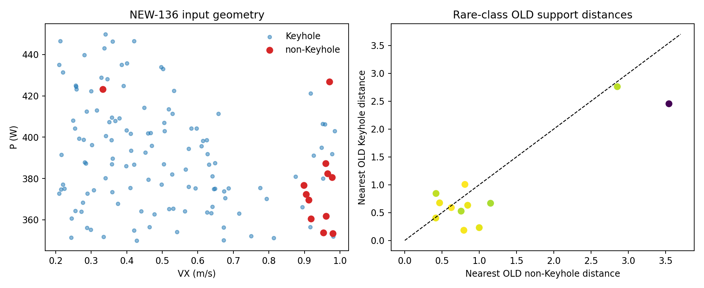
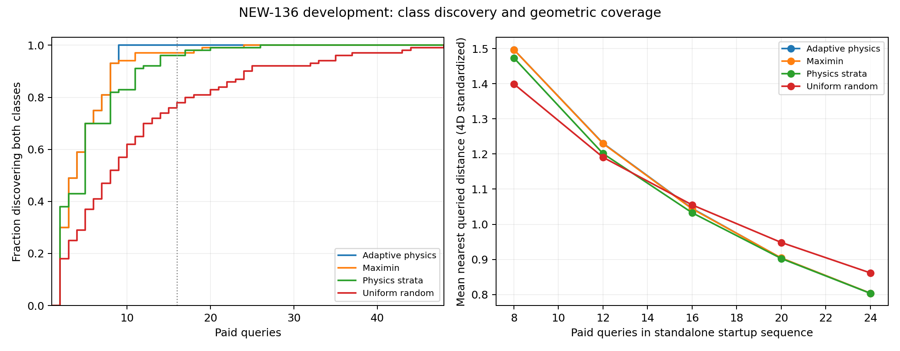
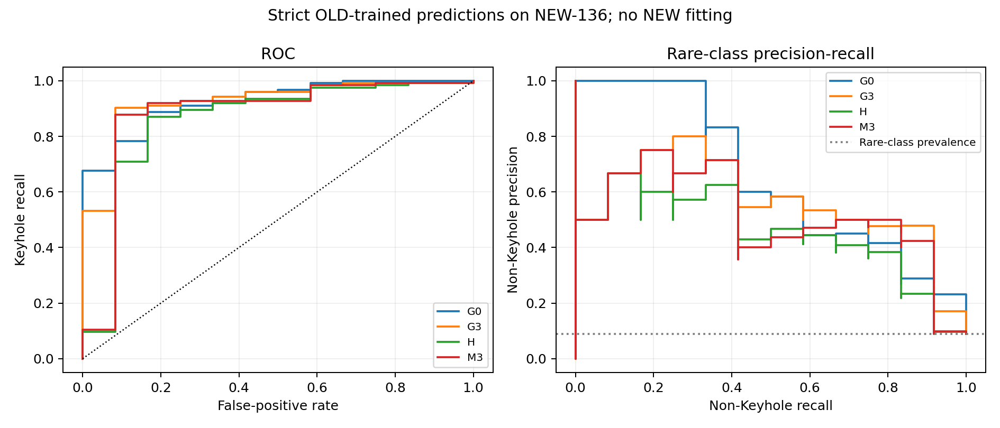
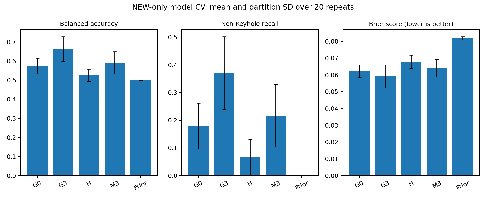
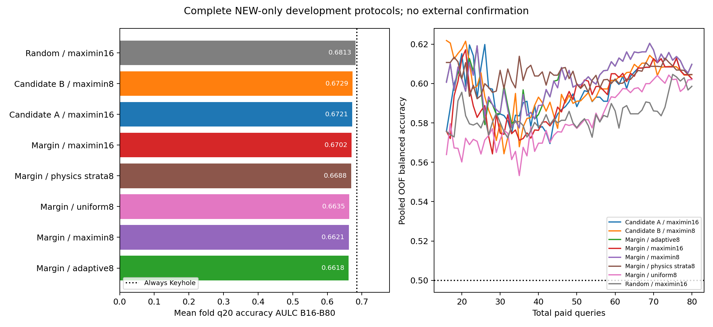
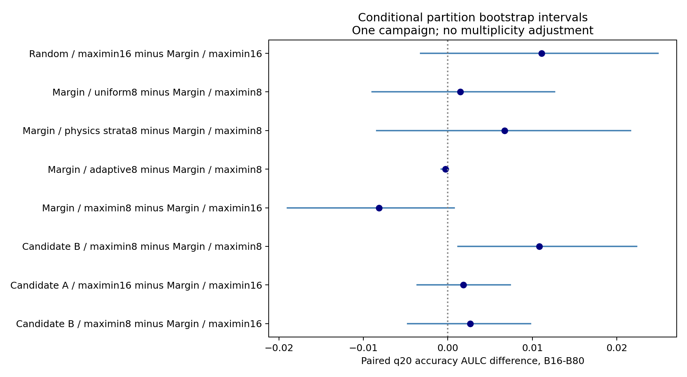
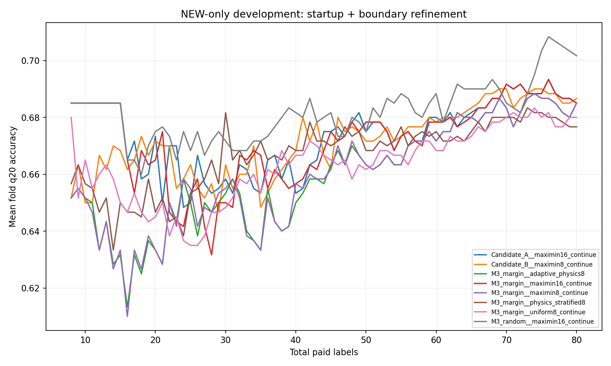

# Week 12 — Startup feasibility, model transfer and paid boundary discovery

Date: 2026-10-03. **Completed post-hoc development and exploratory analysis.**

The startup failure is explained and can be handled with paid discovery. That
operational improvement does not establish better boundary learning. M3 does
not outperform the generic controls on NEW-136, and Candidate B's complete
protocol advantage is small and partition-sensitive. The strongest result is
the separation of startup feasibility, model transfer and acquisition value.

# A. Repository and Evidence Status

The scientific target is `has_keyhole=1` if any genuine Keyhole frame occurs,
including a short episode. Inputs are laser power P, scan speed VX, spot size
LS and **substrate temperature ST**. The objective is finite-pool discovery
and estimation of the Conduction–Keyhole boundary, not ordinary classification
alone. q20 remains the primary empirical hard-region endpoint.

The repository started on `main` at `d8fa330c1e404e4d36569e094db14625249480af`,
identical to remote main after fetch. User-owned `.codex/` was preserved.
All new work is under this Week 12 directory and new Week 12 source files.
The exact `.venv` runtime matches the frozen Week 11 environment. The audit
snapshots 387 protected files; source and input hashes accompany each lane.

| Evidence category | What belongs here | Permitted interpretation |
|---|---|---|
| HISTORICAL CONFIRMATORY / FROZEN | OLD-405 internal Track A records and locked specifications | Historical internal evidence; not independent campaign confirmation |
| FROZEN EXTERNAL ATTEMPT | Week 11 sealed protocol and preserved STOP | Incomplete attempt; no performance inference |
| POST-HOC DEVELOPMENT | Four startup rules, OLD→NEW reconstruction, NEW-only CV and complete protocols | Development on already-open NEW-136 |
| EXPLORATORY | Geometry, subgroups, ARD, neighborhood/error associations and publication hypotheses | Descriptive mechanisms; no causal or prospective claims |

OLD-405 contains 73 Keyhole and 332 non-Keyhole simulations. The independently
generated new campaign at Hugging Face revision
`2e1eec9c98fd57609d2815f174586336ab59da07` provided 185 new simulations;
136 were included and 49 Bug-annotated cases were withheld for this experiment.
The 49 are not declared permanently invalid, and their outcomes are not used.
Included NEW-136 contains 124 Keyhole and 12 non-Keyhole cases. Its labels are
now **POST-HOC DEVELOPMENT DATA**, unsuitable as fresh external confirmation
for methods modified after this diagnosis.

The unique included truth mapping was recovered from the already-authorized
`sim_id,truth` columns only. Original incomplete-run probabilities were never
loaded or scored. Raw SPH frame annotations were not independently relabeled in
this stage; their truth definition and provenance come from the audited Week 11
intake. No OLD and NEW observations were combined for training.

Historical Candidate B's q20 accuracy-AULC advantage, +0.006708, remains below
the +0.01 replacement threshold. Candidate A's historical advantage is +0.003171.
These historical numbers are context, not estimates pooled with Week 12.

# B. Why the External Attempt Stopped

The freeze SHA-256 remains
`856219763ec41ba22eb13ebb5c23e2137fb3d6eb884de71a44f96d80debe1eee`, originally
sealed at commit `e0adbc28b6368ee6366c6dcd7d500632c7b5f8f1`.
At `external__r003_f04`, every one of the 16 paid initialization labels was
Keyhole. The frozen protocol required two classes before fitting its logistic
trend/GPC and explicitly required STOP otherwise. This was a specified
operational failure, not an implementation bug.

The attempt ended with 13 paired folds, 39 complete method paths and 69,030
predictions. Its status stays **INCOMPLETE_FROZEN_STOP**. No effect estimate,
method ranking, replacement decision or acquisition-superiority conclusion is
drawn from that completed subset. The new developmental paths are newly run
and clearly named; they do not resume, repair or confirm the old attempt.

All 100 original training pools contain both classes. Exactly 97 original B16
designs contain both; three miss non-Keyhole. Continuing their original
feature-only maximin order, without reseeding or changing order, gives:

| Original failed design | Non-Keyhole in training pool | First two-class query count | Extra queries beyond 16 |
|---|---:|---:|---:|
| r003_f04 | 8/109 | 18 | 2 |
| r009_f05 | 7/109 | 24 | 8 |
| r019_f04 | 8/109 | 19 | 3 |

Thus enough candidates for B80 did not guarantee a valid two-class model at
B16. The original STOP remains correct even though development can define a
different, paid continuation policy.

# C. Startup / Class-Discovery Geometry

Eleven of the twelve non-Keyhole cases have VX at least approximately 0.898 m/s;
their median VX is 0.9569 versus 0.4506 for Keyhole. One rare case at VX 0.3322
is an important exception. Rare P, LS and ST values span substantial ranges;
the evidence supports concentration near a high-speed region, not a proven
one-dimensional manifold or a causal speed threshold.

The physics coordinate is `log h = log P - 0.5 log VX - 1.5 log LS`.
Non-Keyhole median log h is 20.9932 versus 21.4147 for Keyhole, but the ranges
overlap: [20.7868,21.7061] and [20.7335,22.0404], respectively. Descriptive
rank AUC is 0.8569 for increasing log h predicting Keyhole, and 0.8992 for
increasing VX predicting the rare class. These are marginal associations,
not tuned classifiers or a causal decomposition.

Rare cases have nearby Keyhole neighbors in standardized input space; median
nearest-Keyhole distance is approximately 0.931. A maximin sample can therefore
represent a high-VX region with a Keyhole point while failing to capture the
nearby rare label. The geometry is covered more reliably than its class
composition. Per-point OLD support distances, original order ranks and the
three failed prefixes are retained in `startup/diagnosis/`.

All three failures occur among the 21 pools containing only 7–8 rare cases;
the other 18 such pools succeed, as do the 79 pools with 9–12 rare cases. This
shows the interaction of imbalance, which rare locations survive the split,
geometric ordering and the fixed cutoff. It does not isolate a causal share
for each factor. The cohort shift toward higher P, smaller LS and expanded ST,
plus the altered VX distribution after Bug withholding, makes the startup
contract more demanding. The effect of withholding on physical outcomes
cannot be inferred because those outcomes remain outside the analysis.

Uniform sampling without replacement has exact single-class probability
`[C(n0,b)+C(n1,b)]/C(N,b)`. Summing these probabilities at B16 over the same
100 pools gives 20.805 expected failures, versus 3 observed maximin failures.
Linearity of expectation requires no independence, but this is not a formal
superiority test or a probability that an entire repeated-fold study succeeds.
The complete analytic CDF and class-count-conditioned tables are retained.

# D. Startup Strategies

Four rules were fixed after the geometry diagnosis, before their corrected
benchmark. No grid search or outcome-based parameter tuning was performed.

1. **Maximin:** continue the exact original feature-only order. A training-pool
   StandardScaler defines 4D Euclidean distance, with the original random
   first point and frozen row-index tie rules.
2. **Physics-stratified geometry:** take the same first point, then cycle
   through low, middle and high equal-count training-pool log-h strata. Within
   each stratum choose the point farthest from the revealed set in standardized
   4D. Exhausted strata are skipped cyclically. No labels enter the order.
3. **Adaptive physics:** take the first 8 original maximin points. If only
   Keyhole has been seen, query the lowest remaining log h; if only non-Keyhole
   has been seen, query the highest. Continue until both classes are observed.
   Only queried labels determine this direction. Subsequent standalone
   coverage diagnostics continue geometric maximin from the revealed set;
   downstream active learning instead transitions to the specified refinement.
4. **Uniform random:** a fixed deterministic-seed permutation of the training
   pool, sampled without replacement.

An implementation audit found that the first physics-stratified implementation
incorrectly exhausted the low stratum rather than cycling. Its outputs and
byte-exact original source are retained in `benchmark_implementation_error_v0`,
explicitly excluded from conclusions. The correction implements the original
specification, and actually worsened its apparent discovery performance.
Round-robin and exhausted-stratum tests now check the intended behavior. This
was a recorded implementation correction, not choosing the favorable variant.

# E. Class-Discovery Benchmark

All 100 original candidate pools were evaluated; rows below describe overlapping
partitions of one campaign, not 100 independent replications.

| Rule | Both classes by B8 | By B16 | Mean discovery cost | Median | Maximum | Mean release budget with minimum 8 |
|---|---:|---:|---:|---:|---:|---:|
| Maximin | 93% | 97% | 4.83 | 4 | 24 | 8.47 |
| Physics strata | 82% | 96% | 5.67 | 5 | 26 | 9.01 |
| Adaptive physics | 93% | 100% | 4.43 | 4 | 9 | 8.07 |
| Uniform random | 52% | 78% | 11.32 | 8 | 48 | 13.29 |

The seven maximin prefixes still single-class at B8 each found the second
class on the adaptive rule's next query. This removes the observed long tail
in this cohort. It saves only 0.40 queries on average compared with continued
maximin; the practical benefit is tail reliability, not a dramatic average
query reduction. A future campaign could fail even at a log-h extreme because
the coordinate is not a deterministic class separator.

Physics stratification does not improve discovery over maximin here. Merely
covering the physics range more deliberately is insufficient. Coverage metrics
are reported separately: mean nearest distance and worst nearest distance are
different objectives, so a rule is not declared geometrically best from one
number. At B16 maximin and adaptive physics have almost identical mean nearest
distances, 1.044 and 1.045. Discovery alone does not establish the best complete
boundary-search protocol; that requires SectionH.

# F. Strict OLD→NEW Model Transfer

**CAN EXISTING MODELS BE MEANINGFULLY TESTED WITHOUT MIXING OLD AND NEW? YES.**

The historical specifications are reproduced as deployment-style fits on all
OLD-405 labels. These are reconstructed full-OLD fits of architectures that
were historically evaluated fold-wise, not claimed recovered global weights.
All scalers and kernel optimization use OLD only. NEW labels enter scoring
only, and no NEW calibration or threshold tuning is performed.

H is the historical near-unregularized logistic trend in standardized log h.
G0 is the historical isotropic Matérn-3/2 binary GPC. G3 is the historical
generic 4D ARD Matérn-3/2 GPC. M3 freezes the fitted H latent mean and adds the
historical bounded-amplitude4D ARD Matérn discrepancy. The OLD prevalence
predictor is a simple fixed-prior control. Historical fallback rules and fit
diagnostics are retained; all five fits/predictions completed without failure.

| OLD-trained model | NEW accuracy | Balanced accuracy | ROC AUC | Rare-class AP | Brier | Non-Keyhole recall |
|---|---:|---:|---:|---:|---:|---:|
| H | .9118 | .5000 | .8569 | .4523 | .0736 | 0/12 |
| M3 | .9191 | .5793 | .8797 | .5105 | .0579 | 2/12 |
| G0 | .9412 | .7043 | .9247 | .6540 | .0539 | 5/12 |
| G3 | .9338 | .7003 | .9241 | .5599 | .0506 | 5/12 |
| OLD prevalence | .0882 | .5000 | .5000 | .0882 | .6156 | 12/12 |

M3 improves H's probabilities and ranking, but does not transfer better than
the reasonable generic controls. On the fixed 28-point NEW q20 set, accuracy
is .7143 for M3, .6429 for H and .8214 for G0/G3. q20 is defined from NEW labels
only for retrospective evaluation and is never supplied to training.

For M3−H, the paired class-stratified fixed-prediction bootstrap gives a Brier
difference interval approximately [−.0235,−.0064]. For M3−G3, Brier is worse,
with interval [+.0002,+.0139], and ROC AUC difference interval is approximately
[−.1243,−.0007]. These are descriptive cohort-resampling intervals, not
independent-campaign confirmation. Only 12 negatives exist: removing one at a
time changes M3 ROC AUC from .8695 to .9501 without refitting. The conclusion
is evidence against claiming M3 superiority here, not proof of a universal
ranking. Rare-class AP, both recalls, calibration, Brier and log loss accompany
accuracy; high Keyhole AP alone would be uninformative under 91.2% prevalence.

# G. NEW-Only Model Results

Five historical structures/controls were fit separately on all 108–109 training
rows of each of the original 100 partitions. This is development, not external
validation. All 500 fits and 13,600 held-out predictions completed. OLD labels
and features were not used for fitting or scaling these models.

Nine test folds and 13 q20 subsets contain a single class. No fold is removed
from accuracy. Undefined class-dependent fold metrics are null. The following
secondary class-sensitive summary pools all five held-out folds within each
repeat, then averages the 20 repeat metrics:

| Model | Accuracy | Balanced accuracy | Pooled OOF ROC AUC | Rare-class AP | Brier | Non-Keyhole recall |
|---|---:|---:|---:|---:|---:|---:|
| H | .9026 | .5251 | .8289 | .3799 | .0678 | .0667 |
| M3 | .9004 | .5916 | .8476 | .4095 | .0641 | .2167 |
| G0 | .8993 | .5741 | .8737 | .4318 | .0622 | .1792 |
| G3 | .9033 | .6628 | .9140 | .4844 | .0591 | .3708 |
| Training prevalence | .9118 | .5000 | .3434* | .0726* | .0819 | .0000 |

G3 has the strongest pooled balanced accuracy and Brier here. M3's mean
balanced-accuracy difference from G3 is −.0712, ranging from −.1626 to +.0121
across repeated partitions. Rare-class recall varies substantially; the error
bars in the figure are repeat standard deviations, not independent-campaign
confidence intervals. M3−H mean balanced accuracy is +.0665, so the discrepancy
adds useful information, while full M3 still does not establish superiority
over generic 4D modeling. Mean-fold q20 accuracy is .6700 for M3, .6850 for H
and the prevalence control, and .6917 for G3. Metric choice changes the story;
ordinary accuracy alone would favor always predicting Keyhole.

*The constant training-prevalence control has fold-wise ROC AUC .5. Its pooled
OOF AUC is below .5 because different folds receive different training
prevalences; a fold containing more positives leaves fewer positives for its
training set. This is a cross-fold scoring artifact, not meaningful negative
discrimination. Pooled and mean-fold ROC answer different aggregation questions:
mean evaluable-fold ROC is .9023 for G0, .8999 for G3 and .8770 for M3. The
strongest generic-control conclusion rests on balanced accuracy, rare recall,
calibration and the paired summaries, not a single pooled ROC number.

# H. NEW-Only End-to-End Active Learning

All 100 original folds and eight complete protocols reached B80: 800 paths,
64,000 paid label queries and 1,588,480 held-out predictions. The configuration
was committed at `064e854b` before execution. The same historical M3 evaluator
and frozen margin/coverage selection functions were used; no new acquisition
function was tuned. OLD data were not used for training.

Each protocol follows its named startup rule until its minimum budget **and**
both observed classes are available. Every query counts toward B80. Until
startup finishes, predictions use the explicitly specified Beta(1,1)
observed-prevalence baseline; this is not a one-class GP fit. Candidate A/B use
the historical coverage rule before B40 and margin thereafter. The B16 arms
continue maximin when necessary, so they are developmental protocols with a
different failure policy from the closed external attempt.

Primary AULC is normalized trapezoidal q20 accuracy over every integer budget
B16–B80, averaged equally over folds within repeat and then over 20 repeats.
The exact historical q20 construction is unchanged. Secondary balanced
accuracy pools all held-out predictions within each repeat to retain both
classes. Nine individual test folds and 13 q20 subsets are single-class;
undefined fold metrics remain null. B8–B80 and B16–B40 are secondary endpoints.

| Complete protocol | Mean paid startup | Maximum startup | Primary q20 AULC | Full balanced-accuracy AULC | Non-Keyhole recall at B80 |
|---|---:|---:|---:|---:|---:|
| Margin / maximin16 + continuation | 16.13 | 24 | .67023 | .59353 | .2375 |
| Candidate A / maximin16 + continuation | 16.13 | 24 | .67208 | .59625 | .2375 |
| Candidate B / maximin8 + continuation | 8.47 | 24 | .67288 | .59718 | .2417 |
| Margin / maximin8 + continuation | 8.47 | 24 | .66207 | .60214 | .2542 |
| Margin / adaptive physics8 | 8.07 | 9 | .66176 | .60210 | .2542 |
| Margin / physics strata8 | 9.01 | 26 | .66880 | .60384 | .2458 |
| Margin / uniform8 + continuation | 13.29 | 48 | .66354 | .58168 | .2375 |
| Random refinement / maximin16 + continuation | 16.13 | 24 | .68133 | .58362 | .2250 |

The always-Keyhole reference has mean-fold q20 accuracy .6850 at every budget,
full accuracy .9118 and balanced accuracy .5. **None of these protocols exceeds
that trivial reference on the mean primary endpoint.** Their class-sensitive
performance is better than .5, but rare-class recall remains low. Random
refinement has the largest q20 point estimate and poorer balanced accuracy
than margin. It is not a demonstrated winner: its paired interval spans zero.
This conflict must be reported rather than selecting the favorable metric.

| Paired contrast | q20 AULC difference | Conditional 95% partition interval | Positive repeats |
|---|---:|---:|---:|
| Candidate B − margin16 | +.002643 | [−.004753,+.009792] | 12/20 |
| Candidate A − margin16 | +.001849 | [−.003646,+.007370] | 10/20 |
| Candidate B − margin8 | +.010807 | [+.001198,+.022344] | 12/20 |
| Margin8 − margin16 | −.008164 | [−.018998,+.000756] | 10/20 |
| Adaptive8 − margin8 | −.000313 | [−.000768,+.000052] | 1/20 |
| Physics strata8 − margin8 | +.006732 | [−.008412,+.021628] | 9/20 |
| Uniform8 − margin8 | +.001471 | [−.008972,+.012631] | 9/20 |
| Random16 − margin16 | +.011094 | [−.003217,+.024896] | 14/20 |

Intervals resample paired repeat blocks conditionally on these same 136 cases.
They are descriptive, unadjusted for multiple contrasts, and do not quantify
uncertainty over future campaigns. Repeated partitions do not create more
than 12 unique rare-class observations.

Candidate B's positive point estimate survives only as a weak developmental
direction, not a stable complete-protocol advantage or external confirmation.
Its total difference decomposes exactly as
`+.002643 = −.008164 (early margin) + .010807 (coverage at early start)`.
This is an arithmetic matched-control decomposition, not causal percentages.
Here early margin alone is unfavorable; coverage compensates in that setting.
Candidate A's same-B16 contrast is small and unresolved. The evidence does
not support a general acquisition improvement independent of initialization.
Candidate B−margin16 is +.004826 over B16–B40, but −.000197 over B8–B80;
the endpoint dependence further limits a robust efficiency claim.

Adaptive startup improves discovery reliability without improving the
downstream q20 endpoint: versus matched margin8 its change is −.000313,
and full balanced-accuracy AULC is almost identical (.60210 versus .60214).
It is a useful **operational fallback candidate**, not an established best
boundary-search method. No protocol dominates reliability, cost, q20 and
rare-class performance simultaneously; selecting a universal winner would
overstate these data.

There were 47,619 unique prefix fits and 55,230 per-arm fit records (identical
prefix fits can be shared across arms). No path failed and no model fallback
was used. However, 950 fit records (1.72%) carry optimizer nonconvergence
flags; per-arm rates range from 1.33% to 3.30%. These records were retained
under the unmodified historical evaluator, with full messages and bound
diagnostics. Completion/QC does not mean every numerical optimum was certified.
No post-result retries or retuning were used to alter the comparisons.

# I. OLD+NEW Analysis, If Needed

Pooling was not required and was not performed. Strict transfer, NEW-only
model fitting and NEW-only paid active learning all completed meaningfully.
Adding OLD observations now would answer a different historical-prior
question and would not cure the scarcity of independent NEW rare cases.
Potential value remains a future explicitly separated transfer-learning
comparison, but these results provide no demonstrated pooling benefit. No
claim of equivalence, harm or improvement from pooling is made.

# J. Physics / M3 Transfer Analysis

The physics coordinate retains useful rank information: strict-transfer H has
ROC AUC .8569. Its fitted .5 threshold predicts every NEW case as Keyhole.
M3's discrepancy improves Brier from .0736 to .0579 and identifies two of
twelve non-Keyhole cases, but G0/G3 identify five. For the rare cases, mean
M3 physics latent contribution is +2.9007 and discrepancy contribution is
−1.2620; mean predicted Keyhole probability remains .7130. Thus the correction
acts in the needed direction but is insufficient for most rare cases.

OLD-fitted M3 discrepancy length scales in standardized [P,VX,LS,ST] are
approximately [100,.628,100,100]. Across NEW-only full-training CV fits,
median scales are [100,.589,100,3.225]. Upper-bound frequencies are 76%, 1%,
61% and 47%, respectively. The residual standard deviation reaches its
upper bound of 1 in the OLD fit and all 100 NEW-only fits. All of these
full-training model fits converge; this differs from the smaller-prefix
active-learning numerical warnings above.

These patterns motivate a limited hypothesis: the bounded discrepancy may
have limited flexibility against a shifted physics trend, while VX retains
local predictive structure and ST behavior changes. They do not prove that
the amplitude bound causes the performance gap, that relaxing it will help,
or that ARD scales are physical causal effects. Standardization differs
between OLD and NEW, and only 12 rare cases inform the NEW comparison. No
amplitude/kernel search was launched.

Exploratory Spearman association of distance to the nearest OLD case with
M3 error is −.035 and with Brier loss +.083. In contrast, disagreement among
five OLD nearest-neighbor labels associates with error at +.395 and Brier
at +.567. Entropy and posterior variance associate with loss, but their
mathematical dependence on probabilities/imbalance means they are not
independent evidence of calibrated uncertainty. Error-versus-log-h and
input/support diagnostics are retained at point level.

Within OLD's marginal ST range, NEW has 72 cases and eight rare cases; M3
rare recall is 2/8 and ROC AUC .9609. Outside that range, 64 cases include
four rare cases; recall is 0/4 and AUC .7208. This is a small, confounded
subgroup contrast. It does not establish a causal ST failure or justify
designing a new ST policy. Simple nearest-support distance alone does not
explain the errors; changed local class structure is also relevant.

# K. Scientific Interpretation

The startup problem combines severe imbalance, which rare locations remain
in a training pool, the geometric ordering, and the fixed B16 cutoff under a
changed campaign. The evidence cannot assign a causal percentage to each.
Geometric coverage can be good while rare-label discovery is late. A
physics-directed paid fallback can remove the observed discovery tail
without improving subsequent boundary learning.

Model transfer, model adequacy after retraining, and acquisition efficiency
are separate questions. M3 adds information beyond the physics-only model,
but the generic controls weaken a claim of special physics-model advantage.
The full-model CV results also show that the acquisition policy is not the
only limitation. Repeated active-learning comparisons cannot compensate for
an inadequate rare-class decision rule or sparse boundary evidence.

q20 is retained faithfully, but its majority-class accuracy baseline exposes
an interpretation limitation under this prevalence shift. A result below
.6850 does not demonstrate useful boundary recovery merely because it beats
another GP path. Conversely, a balanced-accuracy gain over .5 does not
demonstrate small geometric boundary error. This study measures a finite-pool
truth-dependent boundary proxy; it does not observe the continuous 4D
physical boundary or a validated simulator-cost saving at fixed boundary
precision. No new primary metric is substituted after seeing the outcomes.

# L. Astra Independent Findings

This requested section records additional scientific findings, not a claim
that a separate external expert or independent campaign validated the work.

- The always-Keyhole baseline exceeds every complete protocol on the mean
  primary q20 endpoint, despite the GP protocols' better balanced accuracy.
  This prevents a headline based on small inter-method accuracy differences.
- Candidate B's matched decomposition changes direction relative to the
  historical story: early margin is unfavorable here, while coverage offsets
  it. A total-protocol advantage cannot be attributed to early start alone.
- All full-training M3 discrepancy fits hit their amplitude ceiling. This
  is a model-diagnostics hypothesis, not evidence authorizing an outcome-led
  search for a more favorable bound.
- Pooled constant-prior ROC below .5 is a fold-prevalence artifact; the
  within-fold control is uninformative. Reporting aggregation is necessary
  to avoid a false comparison with a supposedly anti-predictive baseline.
- The corrected physics-stratification implementation performs worse in
  class discovery than its erroneous predecessor. Keeping that archive and
  excluding it from conclusions protects against accidental winner selection.

# M. Novelty / Publication Assessment

Cold start, imbalance and staged warm-up are established topics; claiming
their general discovery as new is untenable. Barata et al. already study a
staged strategy under severe imbalance. Chandra et al. examine initial-pool
design and do not establish a conclusive long-run advantage of intelligent
initialization over random initialization in their study.
[Barata et al., 2021](https://arxiv.org/abs/2107.07724),
[Chandra et al., 2021](https://proceedings.mlr.press/v148/chandra21a.html).

Binary GP level-set acquisition also has direct methodological precedent:
Letham et al. derive look-ahead approaches for Bernoulli level-set estimation.
That work limits novelty claims about binary boundary acquisition itself;
its specific methods are not newly benchmarked in this task.
[Letham et al., AISTATS 2022](https://proceedings.mlr.press/v151/letham22a.html).

Recent initialization work remains active: Chen et al. use contrastive
features for medical cold start, and Hattat et al.'s June 2026 preprint uses
dataset-aware stratified initialization in 3D medical segmentation. These
settings differ from finite-pool SPH boundary search, but reinforce that
geometry-aware initialization alone is not a credible broad novelty claim.
[Chen et al., 2024](https://proceedings.mlr.press/v227/chen24a.html),
[Hattat et al., 2026 preprint](https://arxiv.org/abs/2606.20765).

Zhao et al. address active learning under label shift. Their unchanged
class-conditional feature-distribution assumption is not established for
this campaign, which also changes input support; its guarantees cannot be
transferred to these results.
[Zhao et al., AISTATS 2021](https://proceedings.mlr.press/v130/zhao21b.html).

The realistic publication route is a rigorous application/methodology study
of **startup feasibility and model–acquisition mismatch under campaign
shift**, with a transparently reported negative external attempt and paid
developmental comparison. Present evidence supports a bounded case study;
it does not support a new universally superior acquisition method, guaranteed
physics-guided discovery, or a confirmed replacement for M3-margin.

What already exists: frozen historical evidence, a preserved prospective
STOP, mechanistic class-discovery analysis, reasonable separated model
controls, and complete cost-accounted developmental paths. What is missing:
independent prospective replication of the revised startup contract,
adequate rare-class/boundary evidence and a defensible advantage in physical
boundary estimation or cost at fixed accuracy. Another independent simulation
campaign is required for an external methodological claim about the revised
protocol. The current study can still support a careful MSc thesis and
possibly an application-focused negative-results paper; acceptance or novelty
is not established by this targeted, non-exhaustive literature check.

# N. Recommended Next Step

**First priority: one new, label-blind independent campaign with a frozen paid
discovery protocol.** Before opening labels, fix the target domain, sampling
plan, technical exclusions, budgets, maximum startup/STOP rule, q20 evaluator,
always-majority reference, rare-class safeguards and model/acquisition
comparators. Compare continued maximin with the now-defined adaptive fallback
at the same minimum startup and the same refinement rule. Keep every discovery
query in total cost; never condition the main result on successful startup.
Use input/physics-based sampling to obtain boundary coverage without using
future labels to choose a favorable cohort. Determine campaign size and rare
case adequacy before labels; 12 rare cases are insufficient for precise
general claims. Do not announce 100% reliability from the current partitions.

**Second priority, within that same campaign where feasible: a frozen model
check of H, M3 and G3 on identical paid prefixes.** This separates whether
physics is useful from whether the acquisition path is useful, without a
new acquisition search. Retain the M3 bounds exactly or preregister one
mechanistically justified alternative before data, but do not tune a family
of alternatives on NEW-136. A standalone broad amplitude/kernel search is
not recommended by this evidence.

No more OLD-405 acquisition mining, no reopening of Week 11, and no pooling
to manufacture stronger evidence are needed. Candidate B remains a historical
frozen challenger, with no external confirmation or replacement decision.

## Explicit answers to Q1–Q12

| Question | Decision |
|---|---|
| Q1: Why STOP? | r003_f04's B16 labels were all Keyhole; the frozen two-class prerequisite required STOP. |
| Q2: Main cause? | A combination of imbalance, geometry, split composition, campaign shift and cutoff; causal shares are unidentified. |
| Q3: Best startup tradeoff? | Adaptive8 has the best observed discovery tail/cost; downstream improvement is absent. No overall boundary-search winner is established. |
| Q4: Evaluate models without mixing? | Yes: strict OLD→NEW and all 100 NEW-only CV folds completed separately. |
| Q5: OLD-trained M3 transfer? | BA .5793, ROC .8797, Brier .0579, rare recall 2/12; useful ranking but weak rare detection. |
| Q6: Physics model better than controls? | No: M3 improves H but G0/G3 outperform it on important strict-transfer and NEW-only measures. |
| Q7: Compare acquisition NEW-only? | Yes, with explicit paid startup, fixed evaluator and all 800 completed paths; claims remain developmental. |
| Q8: Candidate B pattern survives? | Only a small positive point direction (+.002643); interval spans zero and B8–B80 reverses slightly. No robust confirmation. |
| Q9: Acquisition or initialization? | A's same-B16 gain is unresolved; B's coverage compensates an unfavorable early-margin component. No general pure-acquisition superiority. |
| Q10: Value of mixing? | Not needed for these questions and untested; its additional value is not established. |
| Q11: Strongest thesis contribution? | An auditable separation of feasibility, transfer and complete-protocol efficiency, revealing failure modes under campaign shift. |
| Q12: Publication path? | A bounded methodological/application study is plausible; a strong revised-method claim needs a preregistered independent campaign with adequate rare/boundary evidence. |

## Integrity, limitations and evidence map

All five stage QC files and the final structural validation pass. Independent
checks replay paid startup choices, verify exact q20 flags and held-out IDs,
check all 64,000 charged queries, and compare all 387 protected hashes. The
49 withheld outcomes remain unused. The frozen run stays closed. The focused
Week 12 suite has 15 passing tests; 16 historical implementation tests pass,
while four pre-existing archive/branch-assumption checks fail and are documented
in `audit/historical_test_limitations.json`. No claim that the entire historical
repository test suite passes is made.

Code, exact configurations, deterministic seeds, input/source provenance,
raw predictions/query ledgers, optimizer records, reports and figures are
retained. See [reproduction instructions](REPRODUCIBILITY.md),
[final QC](FINAL_QC.json), [artifact manifest](ARTIFACT_MANIFEST.json),
[complete-protocol summary](active_learning/summary.json), and
[targeted literature record](interpretation/TARGETED_LITERATURE.md).
Primary data-generation physics, raw frame relabeling and future-campaign
generalization were not independently verified by this computational audit.
