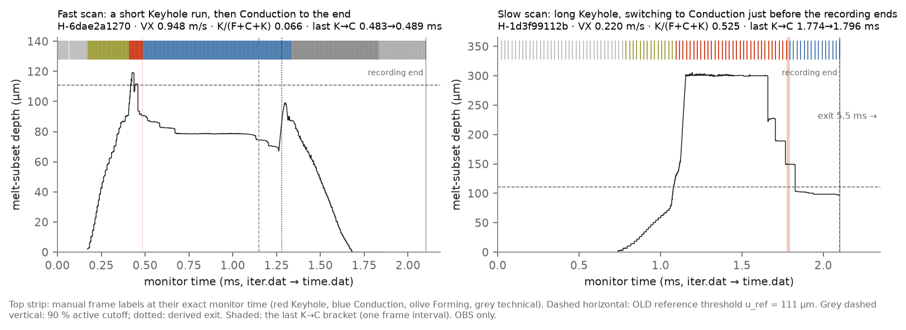
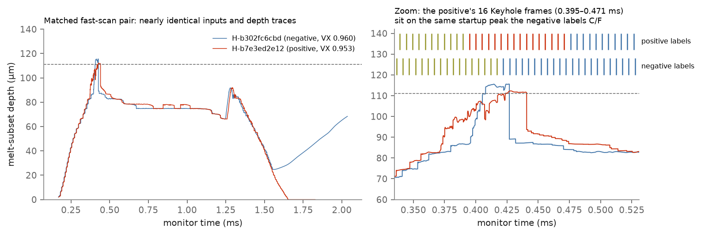
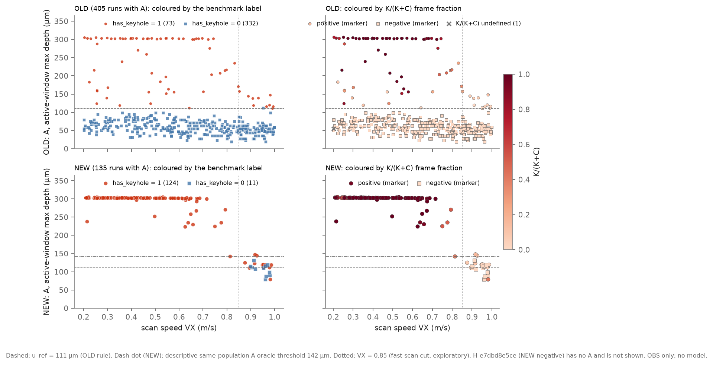

# Keyhole→Conduction and the NEW depth/label mismatch: summary for Ioan

*Week 19, 10 October 2026. Everything below is observation (OBS) unless marked. Section 4 is a post-hoc, exploratory development check (DEV repeats only), not a confirmed result. No label, exclusion or historical result was changed.*

**Data.** All 541 eligible runs (405 OLD, 136 NEW): manual frame labels placed at their exact monitor time (`iter.dat` → `time.dat`; the folder `DT` is the frame interval, not the solver step) and melt-subset depth from `position-bounds_melt.dat`.

**1. Keyhole followed by only Conduction comes in two forms (Figure 1).**
- **Fast scans** (VX ≥ 0.85 m/s; 11 NEW, 10 OLD): a short Keyhole run right after Forming (median K/(F+C+K) 0.066 NEW, 0.043 OLD), ending near 0.47–0.48 ms; Conduction for the rest of the track.
- **Slow scans** (VX < 0.4; 12 NEW, 7 OLD): long Keyhole at about 300 µm, switching to Conduction 15–21 frames before the fixed 2.1 ms recording end, with the scan unfinished.
- Timing is almost the same in OLD and NEW. Alternation (C frames between K frames) occurs in 9 NEW and 13 OLD runs; each switch is known to one frame interval (about 7 µs).

**2. The matched fast-scan pair (Figure 2): similar inputs and depth trajectories, opposite recorded labels; the morphology difference has not been established.** *[corrected 2026-10-10]* H-b302fc6cbd is the negative and H-b7e3ed2e12 the positive. The positive's 16 Keyhole frames (0.395–0.471 ms) coincide with the same startup depth peak (112–116 µm) that the negative's frames label Forming/Conduction.

**3. The active window restores the depth ranking, except in fast scans (Figure 3, Table 1).** A is the maximum depth up to 90 % of the derived exit time (startup kept).
- **NEW overall:** AUC 0.889 for the whole-record maximum vs 0.978 for A (135 runs).
- **NEW fast scans** (VX > 0.85, 23 runs): 0.705 vs 0.773. Labels redefined by K/(K+C) ≥ 5 % or ≥ 10 % give 0.62–0.76, so changing the label's K-fraction cut does not remove the problem.
- **OLD fast scans** separate almost perfectly (98 runs, AUC 0.999).

**4. Small model check (exploratory, DEV only).**
- **Setup.** Each model was trained on the same 40 simulations per NEW fold, picked by a fixed space-filling rule that ignores labels, and then predicted the held-out runs.
- **Result.** A GP of A beat the same GP of the whole-record maximum: balanced accuracy 0.73 vs 0.63, with 12 vs 7 of 24 negative predictions right. The binary GP classifier scored 0.62.
- **Not fixed.** The four unresolved fast-scan negatives were still called Keyhole in 6 of 8 predictions. H-349225d53c, whose Keyhole frames all come after the 90 % cutoff, was missed by the A model in both repeats (the whole-record model caught it).

**What would help most.** Your reading of the six runs below: do the images show a cavity where depth is raised but the label says Conduction or Forming, or the reverse?

*[updated 2026-10-10]* The 30 linked images are now in [ioan_gallery/GALLERY.md](ioan_gallery/GALLERY.md) as contact sheets without labels; the labels are in a separate key. A usability check (no morphology judgement) found 22 usable, 6 nearly empty, 1 blank and 1 unclear. Meeting brief: [IOAN_MEETING_BRIEF.md](IOAN_MEETING_BRIEF.md).

*Figure 1. The two K→C forms (NEW examples, chosen as the runs closest to their subgroup's median K fraction).*

*Figure 2. The matched fast-scan pair.*

*Figure 3. A against scan speed, coloured by the benchmark label (left) and by K/(K+C) (right).*

**Table 1. How well whole-record max depth and A separate three label definitions.** Values are AUC and the descriptive same-population oracle BA. Both depths are computed on the same runs (A available). `has_keyhole` is the unchanged benchmark label; the K/(K+C) labels are descriptive alternatives only. "Undefined ratio" counts runs with no K or C frame; "A missing" counts the one NEW run whose bounds and time rows do not align. Fast-scan rows are exploratory. Full table with whole-record max on all runs: `tables/descriptive_whole_vs_A_by_label.csv`.

| Campaign | Runs | Label | n (pos/neg) | Undefined ratio | A missing | Whole max AUC | Whole max oracle BA | A AUC | A oracle BA |
|---|---|---|---|---:|---:|---:|---:|---:|---:|
| OLD | all | has_keyhole | 405 (73/332) | 0 | 0 | 1.000 | 0.998 | 1.000 | 0.998 |
| OLD | all | K/(K+C)>=0.05 | 404 (67/337) | 1 | 0 | 1.000 | 0.997 | 1.000 | 0.997 |
| OLD | all | K/(K+C)>=0.10 | 404 (62/342) | 1 | 0 | 0.996 | 0.990 | 0.998 | 0.990 |
| OLD | VX > 0.85 *(exploratory)* | has_keyhole | 98 (10/88) | 0 | 0 | 0.999 | 0.994 | 0.999 | 0.994 |
| OLD | VX > 0.85 *(exploratory)* | K/(K+C)>=0.05 | 98 (5/93) | 0 | 0 | 1.000 | 1.000 | 1.000 | 1.000 |
| OLD | VX > 0.85 *(exploratory)* | K/(K+C)>=0.10 | 98 (2/96) | 0 | 0 | 0.990 | 0.995 | 1.000 | 1.000 |
| NEW | all | has_keyhole | 135 (124/11) | 0 | 1 | 0.889 | 0.914 | 0.978 | 0.960 |
| NEW | all | K/(K+C)>=0.05 | 135 (120/15) | 1 | 0 | 0.919 | 0.942 | 0.984 | 0.975 |
| NEW | all | K/(K+C)>=0.10 | 135 (116/19) | 1 | 0 | 0.936 | 0.961 | 0.987 | 0.983 |
| NEW | VX > 0.85 *(exploratory)* | has_keyhole | 23 (12/11) | 0 | 0 | 0.705 | 0.742 | 0.773 | 0.788 |
| NEW | VX > 0.85 *(exploratory)* | K/(K+C)>=0.05 | 23 (8/15) | 0 | 0 | 0.717 | 0.742 | 0.758 | 0.775 |
| NEW | VX > 0.85 *(exploratory)* | K/(K+C)>=0.10 | 23 (4/19) | 0 | 0 | 0.618 | 0.691 | 0.632 | 0.717 |

## Six runs to inspect

All links are at the pinned NEW revision `2e1eec9c98fd57609d2815f174586336ab59da07`. Each link was checked to exist there (`tables/ioan_case_frames.csv`). Frame numbers are `frame_idx` in `frames.csv`, and times are monitor times.

**1. H-b302fc6cbd**: negative (has_keyhole = 0), fast-scan negative of the matched pair; VX 0.960 m/s; label sequence `IE-F-C-SS-SoS`; whole-record max 115.6 µm, A 115.6 µm.  
Full ID: `P-387p361336282_VX-0p960187357846_LS-4p72484046084e-05_ST-390p52586458_M-TI64_XI-0p0002_XF-0p0014_XL-0p0012_TE-0p0021_DT-5p02414509376e-06_H-b302fc6cbd`  
Bracket: the positive's Keyhole window, same times in both runs; frames 76–90, 0.3969–0.4673 ms; labels F-C.  
Images: frame 82 (0.4271 ms, Conduction): [front](https://huggingface.co/datasets/ioandanielc/sph_v2/resolve/2e1eec9c98fd57609d2815f174586336ab59da07/P-387p361336282_VX-0p960187357846_LS-4p72484046084e-05_ST-390p52586458_M-TI64_XI-0p0002_XF-0p0014_XL-0p0012_TE-0p0021_DT-5p02414509376e-06_H-b302fc6cbd/frames/front/frame_00082.png) · [side](https://huggingface.co/datasets/ioandanielc/sph_v2/resolve/2e1eec9c98fd57609d2815f174586336ab59da07/P-387p361336282_VX-0p960187357846_LS-4p72484046084e-05_ST-390p52586458_M-TI64_XI-0p0002_XF-0p0014_XL-0p0012_TE-0p0021_DT-5p02414509376e-06_H-b302fc6cbd/frames/side/frame_00082.png) · [top](https://huggingface.co/datasets/ioandanielc/sph_v2/resolve/2e1eec9c98fd57609d2815f174586336ab59da07/P-387p361336282_VX-0p960187357846_LS-4p72484046084e-05_ST-390p52586458_M-TI64_XI-0p0002_XF-0p0014_XL-0p0012_TE-0p0021_DT-5p02414509376e-06_H-b302fc6cbd/frames/top/frame_00082.png); [all frames](https://huggingface.co/datasets/ioandanielc/sph_v2/tree/2e1eec9c98fd57609d2815f174586336ab59da07/P-387p361336282_VX-0p960187357846_LS-4p72484046084e-05_ST-390p52586458_M-TI64_XI-0p0002_XF-0p0014_XL-0p0012_TE-0p0021_DT-5p02414509376e-06_H-b302fc6cbd/frames)  
Question: Is the startup peak (115.6 µm at 0.427 ms) a short Keyhole that was labelled Conduction/Forming?

**2. H-b7e3ed2e12**: positive (has_keyhole = 1), fast-scan positive of the matched pair; VX 0.953 m/s; label sequence `IE-F-K-C-SS-SoS`; whole-record max 112.3 µm, A 112.3 µm.  
Full ID: `P-380p041479483_VX-0p952843483906_LS-4p56527036263e-05_ST-376p177191048_M-TI64_XI-0p0002_XF-0p0014_XL-0p0012_TE-0p0021_DT-5p0628678104e-06_H-b7e3ed2e12`  
Bracket: the positive's Keyhole window, same times in both runs; frames 74–89, 0.3949–0.4709 ms; labels K.  
Images: frame 81 (0.4304 ms, Keyhole): [front](https://huggingface.co/datasets/ioandanielc/sph_v2/resolve/2e1eec9c98fd57609d2815f174586336ab59da07/P-380p041479483_VX-0p952843483906_LS-4p56527036263e-05_ST-376p177191048_M-TI64_XI-0p0002_XF-0p0014_XL-0p0012_TE-0p0021_DT-5p0628678104e-06_H-b7e3ed2e12/frames/front/frame_00081.png) · [side](https://huggingface.co/datasets/ioandanielc/sph_v2/resolve/2e1eec9c98fd57609d2815f174586336ab59da07/P-380p041479483_VX-0p952843483906_LS-4p56527036263e-05_ST-376p177191048_M-TI64_XI-0p0002_XF-0p0014_XL-0p0012_TE-0p0021_DT-5p0628678104e-06_H-b7e3ed2e12/frames/side/frame_00081.png) · [top](https://huggingface.co/datasets/ioandanielc/sph_v2/resolve/2e1eec9c98fd57609d2815f174586336ab59da07/P-380p041479483_VX-0p952843483906_LS-4p56527036263e-05_ST-376p177191048_M-TI64_XI-0p0002_XF-0p0014_XL-0p0012_TE-0p0021_DT-5p0628678104e-06_H-b7e3ed2e12/frames/top/frame_00081.png); [all frames](https://huggingface.co/datasets/ioandanielc/sph_v2/tree/2e1eec9c98fd57609d2815f174586336ab59da07/P-380p041479483_VX-0p952843483906_LS-4p56527036263e-05_ST-376p177191048_M-TI64_XI-0p0002_XF-0p0014_XL-0p0012_TE-0p0021_DT-5p0628678104e-06_H-b7e3ed2e12/frames)  
Question: Do the 16 Keyhole frames around its startup peak look different from the negative's frames at the same time?

**3. H-f4fc937e86**: negative (has_keyhole = 0), late-window maximum; VX 0.954 m/s; label sequence `IE-F-C-SS`; whole-record max 312.0 µm, A 110.8 µm.  
Full ID: `P-353p784791664_VX-0p953661701626_LS-4p00659722232e-05_ST-310p795032219_M-TI64_XI-0p0002_XF-0p0014_XL-0p0012_TE-0p0021_DT-5p05852399734e-06_H-f4fc937e86`  
Bracket: depth ≥ 300 µm episode, first to last monitor row; frames 340–410, 1.7502–2.1000 ms; labels SS. First Scanning Stopped frame at 1.305 ms.  
Images: frame 340 (1.7502 ms, Scanning Stopped): [front](https://huggingface.co/datasets/ioandanielc/sph_v2/resolve/2e1eec9c98fd57609d2815f174586336ab59da07/P-353p784791664_VX-0p953661701626_LS-4p00659722232e-05_ST-310p795032219_M-TI64_XI-0p0002_XF-0p0014_XL-0p0012_TE-0p0021_DT-5p05852399734e-06_H-f4fc937e86/frames/front/frame_00340.png) · [side](https://huggingface.co/datasets/ioandanielc/sph_v2/resolve/2e1eec9c98fd57609d2815f174586336ab59da07/P-353p784791664_VX-0p953661701626_LS-4p00659722232e-05_ST-310p795032219_M-TI64_XI-0p0002_XF-0p0014_XL-0p0012_TE-0p0021_DT-5p05852399734e-06_H-f4fc937e86/frames/side/frame_00340.png) · [top](https://huggingface.co/datasets/ioandanielc/sph_v2/resolve/2e1eec9c98fd57609d2815f174586336ab59da07/P-353p784791664_VX-0p953661701626_LS-4p00659722232e-05_ST-310p795032219_M-TI64_XI-0p0002_XF-0p0014_XL-0p0012_TE-0p0021_DT-5p05852399734e-06_H-f4fc937e86/frames/top/frame_00340.png); frame 398 (2.0436 ms, Scanning Stopped): [front](https://huggingface.co/datasets/ioandanielc/sph_v2/resolve/2e1eec9c98fd57609d2815f174586336ab59da07/P-353p784791664_VX-0p953661701626_LS-4p00659722232e-05_ST-310p795032219_M-TI64_XI-0p0002_XF-0p0014_XL-0p0012_TE-0p0021_DT-5p05852399734e-06_H-f4fc937e86/frames/front/frame_00398.png) · [side](https://huggingface.co/datasets/ioandanielc/sph_v2/resolve/2e1eec9c98fd57609d2815f174586336ab59da07/P-353p784791664_VX-0p953661701626_LS-4p00659722232e-05_ST-310p795032219_M-TI64_XI-0p0002_XF-0p0014_XL-0p0012_TE-0p0021_DT-5p05852399734e-06_H-f4fc937e86/frames/side/frame_00398.png) · [top](https://huggingface.co/datasets/ioandanielc/sph_v2/resolve/2e1eec9c98fd57609d2815f174586336ab59da07/P-353p784791664_VX-0p953661701626_LS-4p00659722232e-05_ST-310p795032219_M-TI64_XI-0p0002_XF-0p0014_XL-0p0012_TE-0p0021_DT-5p05852399734e-06_H-f4fc937e86/frames/top/frame_00398.png); [all frames](https://huggingface.co/datasets/ioandanielc/sph_v2/tree/2e1eec9c98fd57609d2815f174586336ab59da07/P-353p784791664_VX-0p953661701626_LS-4p00659722232e-05_ST-310p795032219_M-TI64_XI-0p0002_XF-0p0014_XL-0p0012_TE-0p0021_DT-5p05852399734e-06_H-f4fc937e86/frames)  
Question: Is the 312 µm depth after the derived exit (frames labelled Scanning Stopped) a real cavity or an end-of-track artefact?

**4. H-b2eec677b1**: negative (has_keyhole = 0), persistent depth elevation after the first Conduction frame; VX 0.970 m/s; label sequence `IE-F-C-SS-SoS`; whole-record max 118.8 µm, A 118.8 µm.  
Full ID: `P-426p768553369_VX-0p970152058637_LS-4p12602194162e-05_ST-379p997827854_M-TI64_XI-0p0002_XF-0p0014_XL-0p0012_TE-0p0021_DT-4p97254070645e-06_H-b2eec677b1`  
Bracket: first Conduction frame to the persistent-depth event; frames 89–97, 0.4426–0.4823 ms; labels C. A maximum 118.8 µm at 0.455 ms.  
Images: frame 91 (0.4525 ms, Conduction): [front](https://huggingface.co/datasets/ioandanielc/sph_v2/resolve/2e1eec9c98fd57609d2815f174586336ab59da07/P-426p768553369_VX-0p970152058637_LS-4p12602194162e-05_ST-379p997827854_M-TI64_XI-0p0002_XF-0p0014_XL-0p0012_TE-0p0021_DT-4p97254070645e-06_H-b2eec677b1/frames/front/frame_00091.png) · [side](https://huggingface.co/datasets/ioandanielc/sph_v2/resolve/2e1eec9c98fd57609d2815f174586336ab59da07/P-426p768553369_VX-0p970152058637_LS-4p12602194162e-05_ST-379p997827854_M-TI64_XI-0p0002_XF-0p0014_XL-0p0012_TE-0p0021_DT-4p97254070645e-06_H-b2eec677b1/frames/side/frame_00091.png) · [top](https://huggingface.co/datasets/ioandanielc/sph_v2/resolve/2e1eec9c98fd57609d2815f174586336ab59da07/P-426p768553369_VX-0p970152058637_LS-4p12602194162e-05_ST-379p997827854_M-TI64_XI-0p0002_XF-0p0014_XL-0p0012_TE-0p0021_DT-4p97254070645e-06_H-b2eec677b1/frames/top/frame_00091.png); frame 97 (0.4823 ms, Conduction): [front](https://huggingface.co/datasets/ioandanielc/sph_v2/resolve/2e1eec9c98fd57609d2815f174586336ab59da07/P-426p768553369_VX-0p970152058637_LS-4p12602194162e-05_ST-379p997827854_M-TI64_XI-0p0002_XF-0p0014_XL-0p0012_TE-0p0021_DT-4p97254070645e-06_H-b2eec677b1/frames/front/frame_00097.png) · [side](https://huggingface.co/datasets/ioandanielc/sph_v2/resolve/2e1eec9c98fd57609d2815f174586336ab59da07/P-426p768553369_VX-0p970152058637_LS-4p12602194162e-05_ST-379p997827854_M-TI64_XI-0p0002_XF-0p0014_XL-0p0012_TE-0p0021_DT-4p97254070645e-06_H-b2eec677b1/frames/side/frame_00097.png) · [top](https://huggingface.co/datasets/ioandanielc/sph_v2/resolve/2e1eec9c98fd57609d2815f174586336ab59da07/P-426p768553369_VX-0p970152058637_LS-4p12602194162e-05_ST-379p997827854_M-TI64_XI-0p0002_XF-0p0014_XL-0p0012_TE-0p0021_DT-4p97254070645e-06_H-b2eec677b1/frames/top/frame_00097.png); [all frames](https://huggingface.co/datasets/ioandanielc/sph_v2/tree/2e1eec9c98fd57609d2815f174586336ab59da07/P-426p768553369_VX-0p970152058637_LS-4p12602194162e-05_ST-379p997827854_M-TI64_XI-0p0002_XF-0p0014_XL-0p0012_TE-0p0021_DT-4p97254070645e-06_H-b2eec677b1/frames)  
Question: Is the elevated depth just after the first Conduction frame a cavity that the labels missed?

**5. H-349225d53c**: positive (has_keyhole = 1), late Keyhole at shallow depth; VX 0.981 m/s; label sequence `IE-F-C-K-SoS`; whole-record max 88.8 µm, A 79.0 µm.  
Full ID: `P-351p92267109_VX-0p98107853237_LS-4p98248594664e-05_ST-477p481832276_M-TI64_XI-0p0002_XF-0p0014_XL-0p0012_TE-0p0021_DT-4p91716049617e-06_H-349225d53c`  
Bracket: Keyhole frames, first to last; frames 248–364, 1.2293–1.8046 ms; labels K. 1 Keyhole run; 90 % cutoff at 1.112 ms, derived exit at 1.235 ms.  
Images: frame 248 (1.2293 ms, Keyhole): [front](https://huggingface.co/datasets/ioandanielc/sph_v2/resolve/2e1eec9c98fd57609d2815f174586336ab59da07/P-351p92267109_VX-0p98107853237_LS-4p98248594664e-05_ST-477p481832276_M-TI64_XI-0p0002_XF-0p0014_XL-0p0012_TE-0p0021_DT-4p91716049617e-06_H-349225d53c/frames/front/frame_00248.png) · [side](https://huggingface.co/datasets/ioandanielc/sph_v2/resolve/2e1eec9c98fd57609d2815f174586336ab59da07/P-351p92267109_VX-0p98107853237_LS-4p98248594664e-05_ST-477p481832276_M-TI64_XI-0p0002_XF-0p0014_XL-0p0012_TE-0p0021_DT-4p91716049617e-06_H-349225d53c/frames/side/frame_00248.png) · [top](https://huggingface.co/datasets/ioandanielc/sph_v2/resolve/2e1eec9c98fd57609d2815f174586336ab59da07/P-351p92267109_VX-0p98107853237_LS-4p98248594664e-05_ST-477p481832276_M-TI64_XI-0p0002_XF-0p0014_XL-0p0012_TE-0p0021_DT-4p91716049617e-06_H-349225d53c/frames/top/frame_00248.png); frame 364 (1.8046 ms, Keyhole): [front](https://huggingface.co/datasets/ioandanielc/sph_v2/resolve/2e1eec9c98fd57609d2815f174586336ab59da07/P-351p92267109_VX-0p98107853237_LS-4p98248594664e-05_ST-477p481832276_M-TI64_XI-0p0002_XF-0p0014_XL-0p0012_TE-0p0021_DT-4p91716049617e-06_H-349225d53c/frames/front/frame_00364.png) · [side](https://huggingface.co/datasets/ioandanielc/sph_v2/resolve/2e1eec9c98fd57609d2815f174586336ab59da07/P-351p92267109_VX-0p98107853237_LS-4p98248594664e-05_ST-477p481832276_M-TI64_XI-0p0002_XF-0p0014_XL-0p0012_TE-0p0021_DT-4p91716049617e-06_H-349225d53c/frames/side/frame_00364.png) · [top](https://huggingface.co/datasets/ioandanielc/sph_v2/resolve/2e1eec9c98fd57609d2815f174586336ab59da07/P-351p92267109_VX-0p98107853237_LS-4p98248594664e-05_ST-477p481832276_M-TI64_XI-0p0002_XF-0p0014_XL-0p0012_TE-0p0021_DT-4p91716049617e-06_H-349225d53c/frames/top/frame_00364.png); [all frames](https://huggingface.co/datasets/ioandanielc/sph_v2/tree/2e1eec9c98fd57609d2815f174586336ab59da07/P-351p92267109_VX-0p98107853237_LS-4p98248594664e-05_ST-477p481832276_M-TI64_XI-0p0002_XF-0p0014_XL-0p0012_TE-0p0021_DT-4p91716049617e-06_H-349225d53c/frames)  
Question: Are its Keyhole frames (all after the 90 % cutoff, around the exit) consistent with a keyhole at 80–90 µm depth?

**6. H-6ca7f366ce**: positive (has_keyhole = 1), alternating Keyhole/Conduction, short K; VX 0.894 m/s; label sequence `IE-F-K-F-C-K-C-K-C-SS-SoS`; whole-record max 111.3 µm, A 111.3 µm.  
Full ID: `P-366p200299346_VX-0p894349968262_LS-4p89176892953e-05_ST-476p393782659_M-TI64_XI-0p0002_XF-0p0014_XL-0p0012_TE-0p0021_DT-5p39399650496e-06_H-6ca7f366ce`  
Bracket: all K/C switches, first to last; frames 74–88, 0.4099–0.4855 ms; labels K-F-C-K-C-K-C. Switches: K→C frames 74→76 (0.4099→0.4207 ms); C→K frames 80→81 (0.4423→0.4477 ms); K→C frames 81→82 (0.4477→0.4531 ms); C→K frames 83→84 (0.4585→0.4639 ms); K→C frames 87→88 (0.4801→0.4855 ms).  
Images: frame 74 (0.4099 ms, Keyhole): [front](https://huggingface.co/datasets/ioandanielc/sph_v2/resolve/2e1eec9c98fd57609d2815f174586336ab59da07/P-366p200299346_VX-0p894349968262_LS-4p89176892953e-05_ST-476p393782659_M-TI64_XI-0p0002_XF-0p0014_XL-0p0012_TE-0p0021_DT-5p39399650496e-06_H-6ca7f366ce/frames/front/frame_00074.png) · [side](https://huggingface.co/datasets/ioandanielc/sph_v2/resolve/2e1eec9c98fd57609d2815f174586336ab59da07/P-366p200299346_VX-0p894349968262_LS-4p89176892953e-05_ST-476p393782659_M-TI64_XI-0p0002_XF-0p0014_XL-0p0012_TE-0p0021_DT-5p39399650496e-06_H-6ca7f366ce/frames/side/frame_00074.png) · [top](https://huggingface.co/datasets/ioandanielc/sph_v2/resolve/2e1eec9c98fd57609d2815f174586336ab59da07/P-366p200299346_VX-0p894349968262_LS-4p89176892953e-05_ST-476p393782659_M-TI64_XI-0p0002_XF-0p0014_XL-0p0012_TE-0p0021_DT-5p39399650496e-06_H-6ca7f366ce/frames/top/frame_00074.png); frame 76 (0.4207 ms, Conduction): [front](https://huggingface.co/datasets/ioandanielc/sph_v2/resolve/2e1eec9c98fd57609d2815f174586336ab59da07/P-366p200299346_VX-0p894349968262_LS-4p89176892953e-05_ST-476p393782659_M-TI64_XI-0p0002_XF-0p0014_XL-0p0012_TE-0p0021_DT-5p39399650496e-06_H-6ca7f366ce/frames/front/frame_00076.png) · [side](https://huggingface.co/datasets/ioandanielc/sph_v2/resolve/2e1eec9c98fd57609d2815f174586336ab59da07/P-366p200299346_VX-0p894349968262_LS-4p89176892953e-05_ST-476p393782659_M-TI64_XI-0p0002_XF-0p0014_XL-0p0012_TE-0p0021_DT-5p39399650496e-06_H-6ca7f366ce/frames/side/frame_00076.png) · [top](https://huggingface.co/datasets/ioandanielc/sph_v2/resolve/2e1eec9c98fd57609d2815f174586336ab59da07/P-366p200299346_VX-0p894349968262_LS-4p89176892953e-05_ST-476p393782659_M-TI64_XI-0p0002_XF-0p0014_XL-0p0012_TE-0p0021_DT-5p39399650496e-06_H-6ca7f366ce/frames/top/frame_00076.png); [all frames](https://huggingface.co/datasets/ioandanielc/sph_v2/tree/2e1eec9c98fd57609d2815f174586336ab59da07/P-366p200299346_VX-0p894349968262_LS-4p89176892953e-05_ST-476p393782659_M-TI64_XI-0p0002_XF-0p0014_XL-0p0012_TE-0p0021_DT-5p39399650496e-06_H-6ca7f366ce/frames)  
Question: Are the K→C→K switches (one frame interval each) physical alternation or label flicker?

*[added 2026-10-10]* Case 1's linked frame 82 is 0.18 µs after that run's depth maximum. It follows a sharp drop in monitored depth (114.3 µm at frame 81 → 89.1 µm at frame 82). The near-peak frame 81 is not among the linked images.
