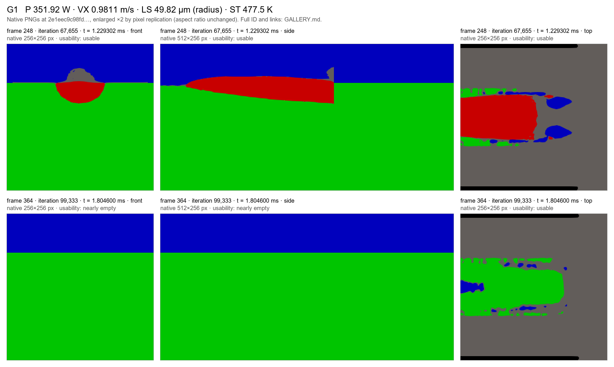
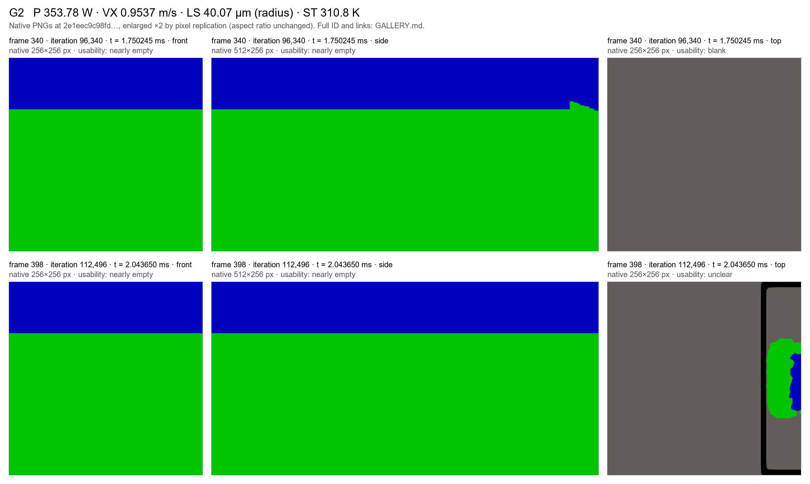
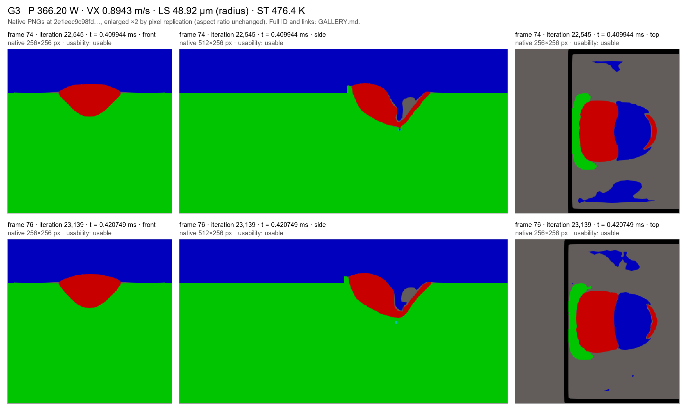
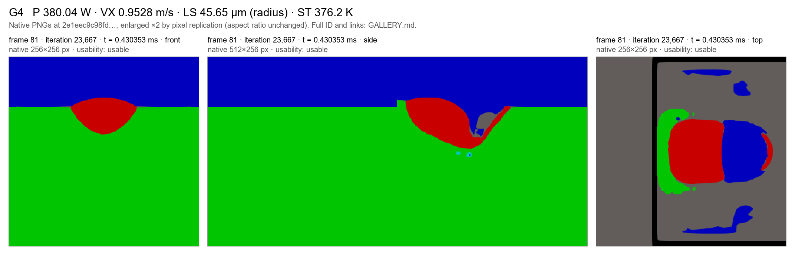
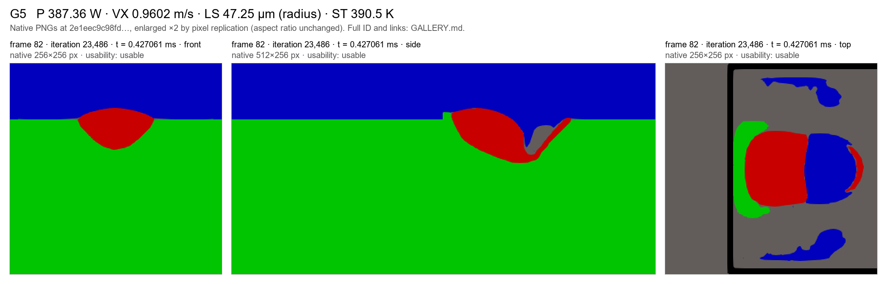
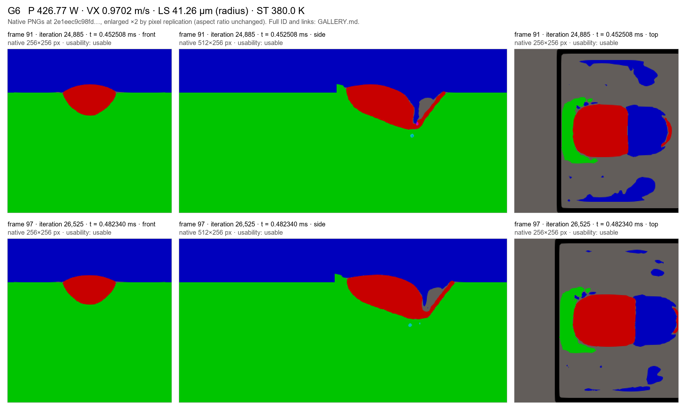
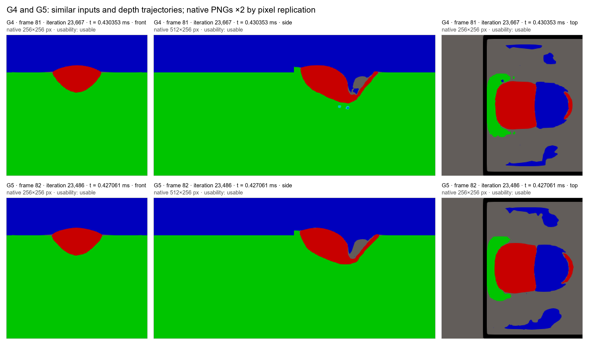

# Six-case image gallery (first pass without labels)

*Week 19 pilot package for Ioan. The 30 images are the dataset's own native renderings, fetched at the pinned NEW revision `2e1eec9c98fd57609d2815f174586336ab59da07`; each was verified by its LFS SHA-256 (`image_inventory.csv`). Nothing here assigns a regime label or infers cavity geometry.*

**For a first pass without labels:** recorded labels, monitored depths and model predictions are kept separately in [KEY.md](KEY.md). Please look at the images first. Cases are coded G1–G6 by sorting the full simulation IDs; the code order carries no label information.

**Usability (visual check, usability only):** 22 usable, 6 nearly empty, 1 blank, 1 unclear, 0 unreadable, 0 missing. 5 images are byte-identical to another image in this set.

**Display:** contact sheets enlarge each native image ×2 by pixel replication (no interpolation, native aspect ratio). Front and top views are 256×256 px, side views 512×256 px. Frame numbers are `frame_idx` in `frames.csv`; iterations are solver iterations; times are monitor times (`iter.dat` → `time.dat`).

## G1

Full ID: `P-351p92267109_VX-0p98107853237_LS-4p98248594664e-05_ST-477p481832276_M-TI64_XI-0p0002_XF-0p0014_XL-0p0012_TE-0p0021_DT-4p91716049617e-06_H-349225d53c`  
Folder at the pinned revision: [H-349225d53c/frames](https://huggingface.co/datasets/ioandanielc/sph_v2/tree/2e1eec9c98fd57609d2815f174586336ab59da07/P-351p92267109_VX-0p98107853237_LS-4p98248594664e-05_ST-477p481832276_M-TI64_XI-0p0002_XF-0p0014_XL-0p0012_TE-0p0021_DT-4p91716049617e-06_H-349225d53c/frames)

| Frame | Iteration | Time (ms) | View | Native px | Usability | Note | Original |
|---:|---:|---:|---|---|---|---|---|
| 248 | 67,655 | 1.229302 | front | 256×256 | usable | content inside the field of view; legible at native resolution | [png](https://huggingface.co/datasets/ioandanielc/sph_v2/resolve/2e1eec9c98fd57609d2815f174586336ab59da07/P-351p92267109_VX-0p98107853237_LS-4p98248594664e-05_ST-477p481832276_M-TI64_XI-0p0002_XF-0p0014_XL-0p0012_TE-0p0021_DT-4p91716049617e-06_H-349225d53c/frames/front/frame_00248.png) |
| 248 | 67,655 | 1.229302 | side | 512×256 | usable | content inside the field of view; legible at native resolution | [png](https://huggingface.co/datasets/ioandanielc/sph_v2/resolve/2e1eec9c98fd57609d2815f174586336ab59da07/P-351p92267109_VX-0p98107853237_LS-4p98248594664e-05_ST-477p481832276_M-TI64_XI-0p0002_XF-0p0014_XL-0p0012_TE-0p0021_DT-4p91716049617e-06_H-349225d53c/frames/side/frame_00248.png) |
| 248 | 67,655 | 1.229302 | top | 256×256 | usable | content inside the field of view; legible at native resolution | [png](https://huggingface.co/datasets/ioandanielc/sph_v2/resolve/2e1eec9c98fd57609d2815f174586336ab59da07/P-351p92267109_VX-0p98107853237_LS-4p98248594664e-05_ST-477p481832276_M-TI64_XI-0p0002_XF-0p0014_XL-0p0012_TE-0p0021_DT-4p91716049617e-06_H-349225d53c/frames/top/frame_00248.png) |
| 364 | 99,333 | 1.804600 | front | 256×256 | nearly empty | two colours, background layers only; no simulation-specific feature; byte-identical to G2 frame 340 front, G2 frame 398 front | [png](https://huggingface.co/datasets/ioandanielc/sph_v2/resolve/2e1eec9c98fd57609d2815f174586336ab59da07/P-351p92267109_VX-0p98107853237_LS-4p98248594664e-05_ST-477p481832276_M-TI64_XI-0p0002_XF-0p0014_XL-0p0012_TE-0p0021_DT-4p91716049617e-06_H-349225d53c/frames/front/frame_00364.png) |
| 364 | 99,333 | 1.804600 | side | 512×256 | nearly empty | two colours, background layers only; no simulation-specific feature; byte-identical to G2 frame 398 side | [png](https://huggingface.co/datasets/ioandanielc/sph_v2/resolve/2e1eec9c98fd57609d2815f174586336ab59da07/P-351p92267109_VX-0p98107853237_LS-4p98248594664e-05_ST-477p481832276_M-TI64_XI-0p0002_XF-0p0014_XL-0p0012_TE-0p0021_DT-4p91716049617e-06_H-349225d53c/frames/side/frame_00364.png) |
| 364 | 99,333 | 1.804600 | top | 256×256 | usable | content inside the field of view; legible at native resolution | [png](https://huggingface.co/datasets/ioandanielc/sph_v2/resolve/2e1eec9c98fd57609d2815f174586336ab59da07/P-351p92267109_VX-0p98107853237_LS-4p98248594664e-05_ST-477p481832276_M-TI64_XI-0p0002_XF-0p0014_XL-0p0012_TE-0p0021_DT-4p91716049617e-06_H-349225d53c/frames/top/frame_00364.png) |

## G2

Full ID: `P-353p784791664_VX-0p953661701626_LS-4p00659722232e-05_ST-310p795032219_M-TI64_XI-0p0002_XF-0p0014_XL-0p0012_TE-0p0021_DT-5p05852399734e-06_H-f4fc937e86`  
Folder at the pinned revision: [H-f4fc937e86/frames](https://huggingface.co/datasets/ioandanielc/sph_v2/tree/2e1eec9c98fd57609d2815f174586336ab59da07/P-353p784791664_VX-0p953661701626_LS-4p00659722232e-05_ST-310p795032219_M-TI64_XI-0p0002_XF-0p0014_XL-0p0012_TE-0p0021_DT-5p05852399734e-06_H-f4fc937e86/frames)

| Frame | Iteration | Time (ms) | View | Native px | Usability | Note | Original |
|---:|---:|---:|---|---|---|---|---|
| 340 | 96,340 | 1.750245 | front | 256×256 | nearly empty | two colours, background layers only; no simulation-specific feature; byte-identical to G2 frame 398 front, G1 frame 364 front | [png](https://huggingface.co/datasets/ioandanielc/sph_v2/resolve/2e1eec9c98fd57609d2815f174586336ab59da07/P-353p784791664_VX-0p953661701626_LS-4p00659722232e-05_ST-310p795032219_M-TI64_XI-0p0002_XF-0p0014_XL-0p0012_TE-0p0021_DT-5p05852399734e-06_H-f4fc937e86/frames/front/frame_00340.png) |
| 340 | 96,340 | 1.750245 | side | 512×256 | nearly empty | background layers with one small feature at the right image border only | [png](https://huggingface.co/datasets/ioandanielc/sph_v2/resolve/2e1eec9c98fd57609d2815f174586336ab59da07/P-353p784791664_VX-0p953661701626_LS-4p00659722232e-05_ST-310p795032219_M-TI64_XI-0p0002_XF-0p0014_XL-0p0012_TE-0p0021_DT-5p05852399734e-06_H-f4fc937e86/frames/side/frame_00340.png) |
| 340 | 96,340 | 1.750245 | top | 256×256 | blank | a single uniform colour | [png](https://huggingface.co/datasets/ioandanielc/sph_v2/resolve/2e1eec9c98fd57609d2815f174586336ab59da07/P-353p784791664_VX-0p953661701626_LS-4p00659722232e-05_ST-310p795032219_M-TI64_XI-0p0002_XF-0p0014_XL-0p0012_TE-0p0021_DT-5p05852399734e-06_H-f4fc937e86/frames/top/frame_00340.png) |
| 398 | 112,496 | 2.043650 | front | 256×256 | nearly empty | two colours, background layers only; no simulation-specific feature; byte-identical to G2 frame 340 front, G1 frame 364 front | [png](https://huggingface.co/datasets/ioandanielc/sph_v2/resolve/2e1eec9c98fd57609d2815f174586336ab59da07/P-353p784791664_VX-0p953661701626_LS-4p00659722232e-05_ST-310p795032219_M-TI64_XI-0p0002_XF-0p0014_XL-0p0012_TE-0p0021_DT-5p05852399734e-06_H-f4fc937e86/frames/front/frame_00398.png) |
| 398 | 112,496 | 2.043650 | side | 512×256 | nearly empty | two colours, background layers only; no simulation-specific feature; byte-identical to G1 frame 364 side | [png](https://huggingface.co/datasets/ioandanielc/sph_v2/resolve/2e1eec9c98fd57609d2815f174586336ab59da07/P-353p784791664_VX-0p953661701626_LS-4p00659722232e-05_ST-310p795032219_M-TI64_XI-0p0002_XF-0p0014_XL-0p0012_TE-0p0021_DT-5p05852399734e-06_H-f4fc937e86/frames/side/frame_00398.png) |
| 398 | 112,496 | 2.043650 | top | 256×256 | unclear | content only at the right image border, cut off by the field of view | [png](https://huggingface.co/datasets/ioandanielc/sph_v2/resolve/2e1eec9c98fd57609d2815f174586336ab59da07/P-353p784791664_VX-0p953661701626_LS-4p00659722232e-05_ST-310p795032219_M-TI64_XI-0p0002_XF-0p0014_XL-0p0012_TE-0p0021_DT-5p05852399734e-06_H-f4fc937e86/frames/top/frame_00398.png) |

## G3

Full ID: `P-366p200299346_VX-0p894349968262_LS-4p89176892953e-05_ST-476p393782659_M-TI64_XI-0p0002_XF-0p0014_XL-0p0012_TE-0p0021_DT-5p39399650496e-06_H-6ca7f366ce`  
Folder at the pinned revision: [H-6ca7f366ce/frames](https://huggingface.co/datasets/ioandanielc/sph_v2/tree/2e1eec9c98fd57609d2815f174586336ab59da07/P-366p200299346_VX-0p894349968262_LS-4p89176892953e-05_ST-476p393782659_M-TI64_XI-0p0002_XF-0p0014_XL-0p0012_TE-0p0021_DT-5p39399650496e-06_H-6ca7f366ce/frames)

| Frame | Iteration | Time (ms) | View | Native px | Usability | Note | Original |
|---:|---:|---:|---|---|---|---|---|
| 74 | 22,545 | 0.409944 | front | 256×256 | usable | content inside the field of view; legible at native resolution | [png](https://huggingface.co/datasets/ioandanielc/sph_v2/resolve/2e1eec9c98fd57609d2815f174586336ab59da07/P-366p200299346_VX-0p894349968262_LS-4p89176892953e-05_ST-476p393782659_M-TI64_XI-0p0002_XF-0p0014_XL-0p0012_TE-0p0021_DT-5p39399650496e-06_H-6ca7f366ce/frames/front/frame_00074.png) |
| 74 | 22,545 | 0.409944 | side | 512×256 | usable | content inside the field of view; legible at native resolution | [png](https://huggingface.co/datasets/ioandanielc/sph_v2/resolve/2e1eec9c98fd57609d2815f174586336ab59da07/P-366p200299346_VX-0p894349968262_LS-4p89176892953e-05_ST-476p393782659_M-TI64_XI-0p0002_XF-0p0014_XL-0p0012_TE-0p0021_DT-5p39399650496e-06_H-6ca7f366ce/frames/side/frame_00074.png) |
| 74 | 22,545 | 0.409944 | top | 256×256 | usable | content inside the field of view; legible at native resolution | [png](https://huggingface.co/datasets/ioandanielc/sph_v2/resolve/2e1eec9c98fd57609d2815f174586336ab59da07/P-366p200299346_VX-0p894349968262_LS-4p89176892953e-05_ST-476p393782659_M-TI64_XI-0p0002_XF-0p0014_XL-0p0012_TE-0p0021_DT-5p39399650496e-06_H-6ca7f366ce/frames/top/frame_00074.png) |
| 76 | 23,139 | 0.420749 | front | 256×256 | usable | content inside the field of view; legible at native resolution | [png](https://huggingface.co/datasets/ioandanielc/sph_v2/resolve/2e1eec9c98fd57609d2815f174586336ab59da07/P-366p200299346_VX-0p894349968262_LS-4p89176892953e-05_ST-476p393782659_M-TI64_XI-0p0002_XF-0p0014_XL-0p0012_TE-0p0021_DT-5p39399650496e-06_H-6ca7f366ce/frames/front/frame_00076.png) |
| 76 | 23,139 | 0.420749 | side | 512×256 | usable | content inside the field of view; legible at native resolution | [png](https://huggingface.co/datasets/ioandanielc/sph_v2/resolve/2e1eec9c98fd57609d2815f174586336ab59da07/P-366p200299346_VX-0p894349968262_LS-4p89176892953e-05_ST-476p393782659_M-TI64_XI-0p0002_XF-0p0014_XL-0p0012_TE-0p0021_DT-5p39399650496e-06_H-6ca7f366ce/frames/side/frame_00076.png) |
| 76 | 23,139 | 0.420749 | top | 256×256 | usable | content inside the field of view; legible at native resolution | [png](https://huggingface.co/datasets/ioandanielc/sph_v2/resolve/2e1eec9c98fd57609d2815f174586336ab59da07/P-366p200299346_VX-0p894349968262_LS-4p89176892953e-05_ST-476p393782659_M-TI64_XI-0p0002_XF-0p0014_XL-0p0012_TE-0p0021_DT-5p39399650496e-06_H-6ca7f366ce/frames/top/frame_00076.png) |

## G4

Full ID: `P-380p041479483_VX-0p952843483906_LS-4p56527036263e-05_ST-376p177191048_M-TI64_XI-0p0002_XF-0p0014_XL-0p0012_TE-0p0021_DT-5p0628678104e-06_H-b7e3ed2e12`  
Folder at the pinned revision: [H-b7e3ed2e12/frames](https://huggingface.co/datasets/ioandanielc/sph_v2/tree/2e1eec9c98fd57609d2815f174586336ab59da07/P-380p041479483_VX-0p952843483906_LS-4p56527036263e-05_ST-376p177191048_M-TI64_XI-0p0002_XF-0p0014_XL-0p0012_TE-0p0021_DT-5p0628678104e-06_H-b7e3ed2e12/frames)

| Frame | Iteration | Time (ms) | View | Native px | Usability | Note | Original |
|---:|---:|---:|---|---|---|---|---|
| 81 | 23,667 | 0.430353 | front | 256×256 | usable | content inside the field of view; legible at native resolution | [png](https://huggingface.co/datasets/ioandanielc/sph_v2/resolve/2e1eec9c98fd57609d2815f174586336ab59da07/P-380p041479483_VX-0p952843483906_LS-4p56527036263e-05_ST-376p177191048_M-TI64_XI-0p0002_XF-0p0014_XL-0p0012_TE-0p0021_DT-5p0628678104e-06_H-b7e3ed2e12/frames/front/frame_00081.png) |
| 81 | 23,667 | 0.430353 | side | 512×256 | usable | content inside the field of view; legible at native resolution | [png](https://huggingface.co/datasets/ioandanielc/sph_v2/resolve/2e1eec9c98fd57609d2815f174586336ab59da07/P-380p041479483_VX-0p952843483906_LS-4p56527036263e-05_ST-376p177191048_M-TI64_XI-0p0002_XF-0p0014_XL-0p0012_TE-0p0021_DT-5p0628678104e-06_H-b7e3ed2e12/frames/side/frame_00081.png) |
| 81 | 23,667 | 0.430353 | top | 256×256 | usable | content inside the field of view; legible at native resolution | [png](https://huggingface.co/datasets/ioandanielc/sph_v2/resolve/2e1eec9c98fd57609d2815f174586336ab59da07/P-380p041479483_VX-0p952843483906_LS-4p56527036263e-05_ST-376p177191048_M-TI64_XI-0p0002_XF-0p0014_XL-0p0012_TE-0p0021_DT-5p0628678104e-06_H-b7e3ed2e12/frames/top/frame_00081.png) |

## G5

Full ID: `P-387p361336282_VX-0p960187357846_LS-4p72484046084e-05_ST-390p52586458_M-TI64_XI-0p0002_XF-0p0014_XL-0p0012_TE-0p0021_DT-5p02414509376e-06_H-b302fc6cbd`  
Folder at the pinned revision: [H-b302fc6cbd/frames](https://huggingface.co/datasets/ioandanielc/sph_v2/tree/2e1eec9c98fd57609d2815f174586336ab59da07/P-387p361336282_VX-0p960187357846_LS-4p72484046084e-05_ST-390p52586458_M-TI64_XI-0p0002_XF-0p0014_XL-0p0012_TE-0p0021_DT-5p02414509376e-06_H-b302fc6cbd/frames)

| Frame | Iteration | Time (ms) | View | Native px | Usability | Note | Original |
|---:|---:|---:|---|---|---|---|---|
| 82 | 23,486 | 0.427061 | front | 256×256 | usable | content inside the field of view; legible at native resolution | [png](https://huggingface.co/datasets/ioandanielc/sph_v2/resolve/2e1eec9c98fd57609d2815f174586336ab59da07/P-387p361336282_VX-0p960187357846_LS-4p72484046084e-05_ST-390p52586458_M-TI64_XI-0p0002_XF-0p0014_XL-0p0012_TE-0p0021_DT-5p02414509376e-06_H-b302fc6cbd/frames/front/frame_00082.png) |
| 82 | 23,486 | 0.427061 | side | 512×256 | usable | content inside the field of view; legible at native resolution | [png](https://huggingface.co/datasets/ioandanielc/sph_v2/resolve/2e1eec9c98fd57609d2815f174586336ab59da07/P-387p361336282_VX-0p960187357846_LS-4p72484046084e-05_ST-390p52586458_M-TI64_XI-0p0002_XF-0p0014_XL-0p0012_TE-0p0021_DT-5p02414509376e-06_H-b302fc6cbd/frames/side/frame_00082.png) |
| 82 | 23,486 | 0.427061 | top | 256×256 | usable | content inside the field of view; legible at native resolution | [png](https://huggingface.co/datasets/ioandanielc/sph_v2/resolve/2e1eec9c98fd57609d2815f174586336ab59da07/P-387p361336282_VX-0p960187357846_LS-4p72484046084e-05_ST-390p52586458_M-TI64_XI-0p0002_XF-0p0014_XL-0p0012_TE-0p0021_DT-5p02414509376e-06_H-b302fc6cbd/frames/top/frame_00082.png) |

## G6

Full ID: `P-426p768553369_VX-0p970152058637_LS-4p12602194162e-05_ST-379p997827854_M-TI64_XI-0p0002_XF-0p0014_XL-0p0012_TE-0p0021_DT-4p97254070645e-06_H-b2eec677b1`  
Folder at the pinned revision: [H-b2eec677b1/frames](https://huggingface.co/datasets/ioandanielc/sph_v2/tree/2e1eec9c98fd57609d2815f174586336ab59da07/P-426p768553369_VX-0p970152058637_LS-4p12602194162e-05_ST-379p997827854_M-TI64_XI-0p0002_XF-0p0014_XL-0p0012_TE-0p0021_DT-4p97254070645e-06_H-b2eec677b1/frames)

| Frame | Iteration | Time (ms) | View | Native px | Usability | Note | Original |
|---:|---:|---:|---|---|---|---|---|
| 91 | 24,885 | 0.452508 | front | 256×256 | usable | content inside the field of view; legible at native resolution | [png](https://huggingface.co/datasets/ioandanielc/sph_v2/resolve/2e1eec9c98fd57609d2815f174586336ab59da07/P-426p768553369_VX-0p970152058637_LS-4p12602194162e-05_ST-379p997827854_M-TI64_XI-0p0002_XF-0p0014_XL-0p0012_TE-0p0021_DT-4p97254070645e-06_H-b2eec677b1/frames/front/frame_00091.png) |
| 91 | 24,885 | 0.452508 | side | 512×256 | usable | content inside the field of view; legible at native resolution | [png](https://huggingface.co/datasets/ioandanielc/sph_v2/resolve/2e1eec9c98fd57609d2815f174586336ab59da07/P-426p768553369_VX-0p970152058637_LS-4p12602194162e-05_ST-379p997827854_M-TI64_XI-0p0002_XF-0p0014_XL-0p0012_TE-0p0021_DT-4p97254070645e-06_H-b2eec677b1/frames/side/frame_00091.png) |
| 91 | 24,885 | 0.452508 | top | 256×256 | usable | content inside the field of view; legible at native resolution | [png](https://huggingface.co/datasets/ioandanielc/sph_v2/resolve/2e1eec9c98fd57609d2815f174586336ab59da07/P-426p768553369_VX-0p970152058637_LS-4p12602194162e-05_ST-379p997827854_M-TI64_XI-0p0002_XF-0p0014_XL-0p0012_TE-0p0021_DT-4p97254070645e-06_H-b2eec677b1/frames/top/frame_00091.png) |
| 97 | 26,525 | 0.482340 | front | 256×256 | usable | content inside the field of view; legible at native resolution | [png](https://huggingface.co/datasets/ioandanielc/sph_v2/resolve/2e1eec9c98fd57609d2815f174586336ab59da07/P-426p768553369_VX-0p970152058637_LS-4p12602194162e-05_ST-379p997827854_M-TI64_XI-0p0002_XF-0p0014_XL-0p0012_TE-0p0021_DT-4p97254070645e-06_H-b2eec677b1/frames/front/frame_00097.png) |
| 97 | 26,525 | 0.482340 | side | 512×256 | usable | content inside the field of view; legible at native resolution | [png](https://huggingface.co/datasets/ioandanielc/sph_v2/resolve/2e1eec9c98fd57609d2815f174586336ab59da07/P-426p768553369_VX-0p970152058637_LS-4p12602194162e-05_ST-379p997827854_M-TI64_XI-0p0002_XF-0p0014_XL-0p0012_TE-0p0021_DT-4p97254070645e-06_H-b2eec677b1/frames/side/frame_00097.png) |
| 97 | 26,525 | 0.482340 | top | 256×256 | usable | content inside the field of view; legible at native resolution | [png](https://huggingface.co/datasets/ioandanielc/sph_v2/resolve/2e1eec9c98fd57609d2815f174586336ab59da07/P-426p768553369_VX-0p970152058637_LS-4p12602194162e-05_ST-379p997827854_M-TI64_XI-0p0002_XF-0p0014_XL-0p0012_TE-0p0021_DT-4p97254070645e-06_H-b2eec677b1/frames/top/frame_00097.png) |

## G4 and G5 side by side

These two runs have similar inputs and depth trajectories, but opposite recorded labels; the morphology difference has not been established. The sheet repeats their images at the same scale.

